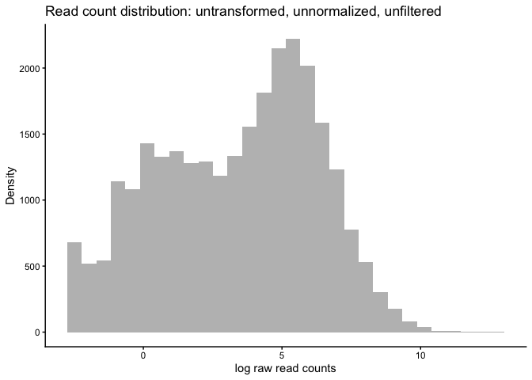
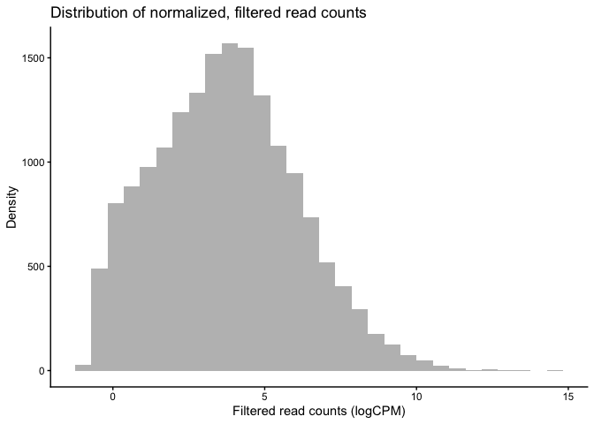
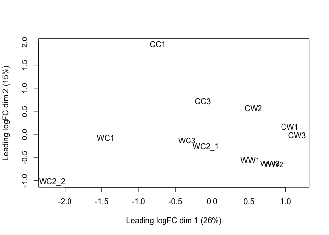
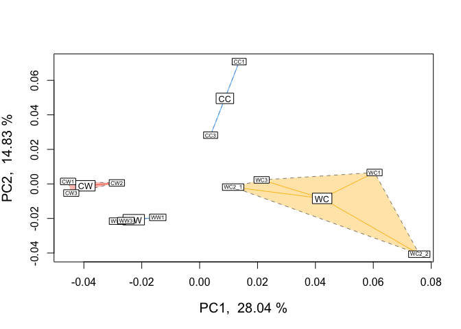
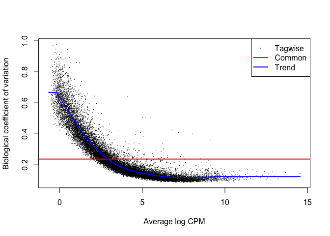
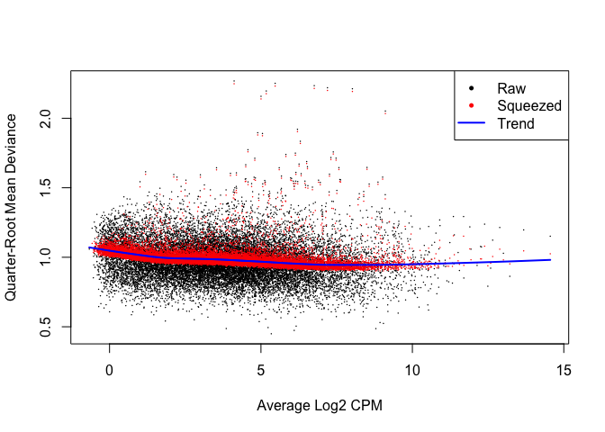
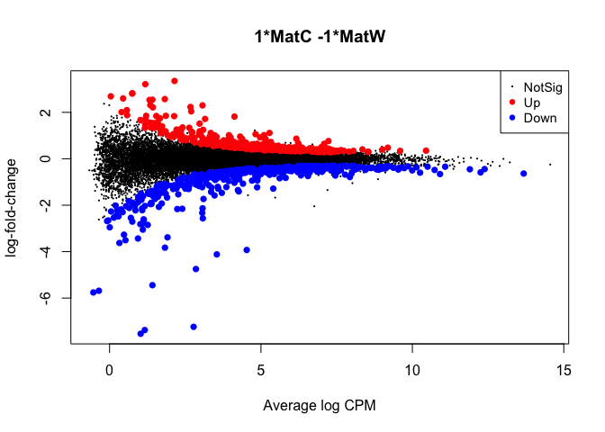
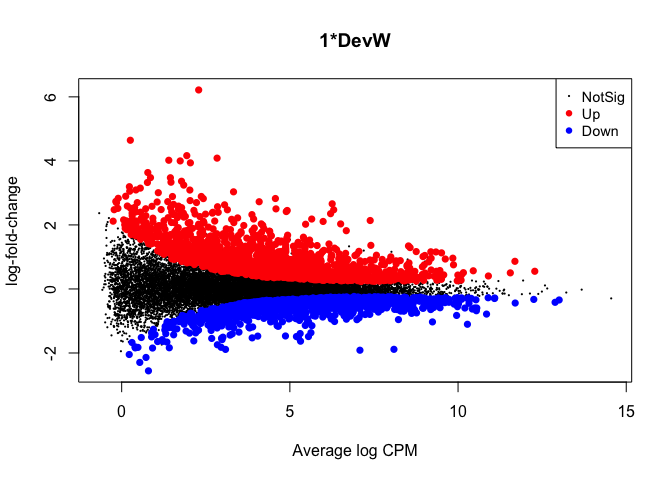
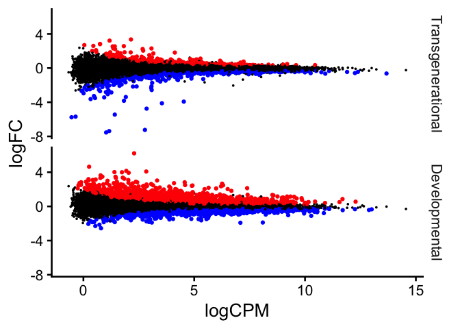
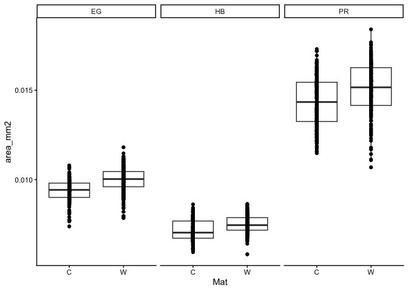

hotpurps_RNAseq
================
Sam Bogan
03/10/2026

# Combining featureCounts .txt files

``` r
# 
myfiles=list.files(path = "featureCounts_gene_id_pairs/txt_files", pattern = "*.txt")  #read in list of featureCounts .txt files

x <- readDGE(myfiles, path = "featureCounts_gene_id_pairs/txt_files/", skip=1, columns=c(1,7)) # need skip=1

counts=as.data.frame(x$counts)

# Shortening column names

colnames(counts)<-substr(colnames(counts), 1,5)

colnames(counts)<-gsub(colnames(counts), pattern = "_s", replacement = "")

# saving combined counts file as .txt 
write.table(counts, file = "combined_featureCounts_HP.txt", sep="\t")
write.csv(counts, "combined_featureCounts_HP.csv")

# counts$gene_id<-row.names(counts) this added a column called gene_id but don't need this

# Plot distribution of unfiltered read counts across all samples 
ggplot(data = data.frame(rowMeans(counts)),
       aes(x = log(rowMeans.counts.))) +
  geom_histogram(fill = "grey") +
  theme_classic() +
  labs(title = "Distribution of unfiltered reads") +
  labs(y = "Density", x = "log raw read counts",
  title = "Read count distribution: untransformed, unnormalized, unfiltered")
```

    ## `stat_bin()` using `bins = 30`. Pick better value `binwidth`.

<!-- -->

\#Tests of differential expression

``` r
# Create maternal treatment variable - this basically "extracts" that the first letter of the treatment which is the maternal treatment
Mat = as.vector(sapply(colnames(counts), 
                       function(col) substr(col, 1, 1))) 

# Create developmental treatment variable - this basically "extracts" that the second letter of the treatment which is the developmental treatment
Dev = as.vector(sapply(colnames(counts),
                       function(col) substr(col, 2, 2)))

Rep = as.vector(sapply(colnames(counts),
                      function(col) substr(col, 3,3)))

# Create df of predictor variables
targets_gc <- data.frame(Mat = Mat,
                         Dev = Dev, 
                         Rep = Rep)

targets_gc$grouping <- paste0(targets_gc$Mat, 
                             targets_gc$Dev,
                             sep="") # the grouping column groups by bucket i.e., CC,CW, WC, WW

# Round counts (if necessary) for use in edgeR
data_input_gc <- sapply(counts,as.numeric)

row.names(data_input_gc) <- row.names(counts)

data_input_gc <- as.data.frame(round(data_input_gc))
```

# Making DGEList and MDS plot

``` r
# Make DGElist

DGEList <- DGEList(counts = data_input_gc, 
                   group = targets_gc$grouping, 
                  remove.zeros = T) #removed 5302 rows with all 0
```

    ## Removing 5302 rows with all zero counts

``` r
# Let's remove genes with less then 0.5 cpm (this is ~10 counts in the count file) in no fewer than 8 samples --> 75% of our samples. Could use 4 for our smallest group size and compare
DGEList_keep <- rowSums(cpm(DGEList) > 0.5) >= 8

# How many genes are removed by read count filter?
table(DGEList_keep)
```

    ## DGEList_keep
    ## FALSE  TRUE 
    ## 10456 17224

``` r
# when I run it with 8:
#DGEList_keep
#FALSE  TRUE 
#10456 17224 

# when I run it with 4:
# DGEList_keep
# FALSE  TRUE 
#  8614 19066 


# Filter and set keep.lib.sizes = F to have R recalculate library sizes after filtering
DGEList <- DGEList[DGEList_keep, 
                   keep.lib.sizes = FALSE]

# Create library size normalization factors
DGEList <- calcNormFactors(DGEList)


# CPM conversion and log^2 transformation of read counts
DGEList_log <- cpm(DGEList,
                   log = TRUE, 
                   prior.count = 2)

ggplot(data = data.frame(rowMeans(DGEList_log)), 
       aes(x = rowMeans.DGEList_log.) ) +
  geom_histogram(fill = "grey") +
  theme_classic() +
  labs(y = "Density", x = "Filtered read counts (logCPM)",
       title = "Distribution of normalized, filtered read counts")
```

    ## `stat_bin()` using `bins = 30`. Pick better value `binwidth`.

<!-- -->

``` r
# MDS of normalized gene read counts
MDS <- plotMDS(DGEList_log)
```

<!-- -->

``` r
# Print MDS plot
MDS
```

    ## An object of class MDS
    ## $eigen.values
    ##  [1]  1.183998e+01  6.963539e+00  6.169750e+00  5.032096e+00  3.552834e+00
    ##  [6]  3.375924e+00  2.342129e+00  2.115601e+00  1.694161e+00  1.499882e+00
    ## [11]  1.442823e+00 -1.110851e-16
    ## 
    ## $eigen.vectors
    ##              [,1]         [,2]        [,3]         [,4]        [,5]        [,6]
    ##  [1,] -0.21487860  0.740071092 -0.07484051 -0.327331942  0.09546360 -0.43194699
    ##  [2,] -0.03688133  0.270301229  0.07372817 -0.118913508  0.11509383  0.75205635
    ##  [3,]  0.30601218  0.060086552 -0.11465503 -0.003295321  0.33445559  0.16904983
    ##  [4,]  0.16306171  0.213714119 -0.40156797  0.685938449 -0.41377434 -0.04776905
    ##  [5,]  0.33514402 -0.008923626 -0.11673203  0.074334861  0.27486262  0.03175141
    ##  [6,] -0.42003499 -0.028553404  0.61628911  0.521009170  0.25742573 -0.10404810
    ##  [7,] -0.02449870 -0.104610332  0.17813672 -0.176643244 -0.25777405  0.04339837
    ##  [8,] -0.63140764 -0.389347119 -0.57626526 -0.082682338  0.15367653  0.04020149
    ##  [9,] -0.09936949 -0.053223704  0.20254340 -0.218737659 -0.64603906  0.18236673
    ## [10,]  0.15043475 -0.213975585  0.05064305 -0.153889951 -0.13108212 -0.36021041
    ## [11,]  0.24373715 -0.246374836  0.06586889 -0.070829465  0.15598996 -0.11669735
    ## [12,]  0.22868095 -0.239164387  0.09685147 -0.128959052  0.06170171 -0.15815228
    ##              [,7]         [,8]        [,9]        [,10]        [,11]     [,12]
    ##  [1,]  0.03033875  0.070011675  0.08873136 -0.022809453  0.011585651 0.2886751
    ##  [2,] -0.45667731 -0.129094040  0.13111725 -0.029826939 -0.023048974 0.2886751
    ##  [3,]  0.42707836 -0.130640690 -0.35254604  0.368463825  0.454203242 0.2886751
    ##  [4,] -0.14169430  0.082301002  0.06718666  0.057619021  0.066780326 0.2886751
    ##  [5,]  0.28284920 -0.052122555 -0.08976018 -0.403533200 -0.674492038 0.2886751
    ##  [6,]  0.07060883 -0.073698470 -0.02251124  0.011589028 -0.002647203 0.2886751
    ##  [7,] -0.13971018  0.644461525 -0.56618988  0.070734565 -0.115899950 0.2886751
    ##  [8,]  0.04184906 -0.005221459  0.01200790  0.005904145 -0.017075325 0.2886751
    ##  [9,]  0.51194214 -0.233862909  0.18960389 -0.103901345  0.030721171 0.2886751
    ## [10,] -0.45220229 -0.604825826 -0.31594614 -0.058432388  0.039142140 0.2886751
    ## [11,] -0.08432790  0.308458004  0.34935068 -0.527496184  0.496685001 0.2886751
    ## [12,] -0.09005435  0.124233743  0.50895574  0.631688924 -0.265954040 0.2886751
    ## 
    ## $var.explained
    ##  [1] 0.25723024 0.15128683 0.13404132 0.10932514 0.07718733 0.07334386
    ##  [7] 0.05088408 0.04596263 0.03680660 0.03258580 0.03134615 0.00000000
    ## 
    ## $dim.plot
    ## [1] 1 2
    ## 
    ## $distance.matrix.squared
    ##                 CC1         CC3         CW1        CW2        CW3          WC1
    ## CC1   -11.246938478 -1.11961169  1.18121098  0.6344427  1.8376984  -0.01607686
    ## CC3    -1.119611692 -6.28193214  0.07155152  0.8266688  0.6709466   0.24295626
    ## CW1     1.181210978  0.07155152 -5.76818278 -0.6099556 -2.6450737   3.24556889
    ## CW2     0.634442732  0.82666877 -0.60995557 -9.3836709 -1.1146954   1.96339706
    ## CW3     1.837698404  0.67094662 -2.64507368 -1.1146954 -5.6430933   3.23962171
    ## WC1    -0.016076859  0.24295626  3.24556889  1.9633971  3.2396217 -12.20026874
    ## WC2_1   0.845460236  0.29270390  1.10742823  1.5860498  1.0793988  -0.01106851
    ## WC2_2   0.001614725  1.09049307  3.61567545  1.8061477  3.8065860  -1.88694680
    ## WC3     0.410882100  0.14577171  1.51871667  1.6052582  1.7218794  -0.31696132
    ## WW1     1.882217731  1.48293876  0.08436373  0.8526989 -0.3240488   1.75890914
    ## WW2     2.923821822  1.27937190 -1.01813296  0.7810674 -1.4825502   2.00236067
    ## WW3     2.665278300  1.29814132 -0.78317048  1.0525914 -1.1466695   1.97850849
    ##             WC2_1         WC2_2         WC3         WW1        WW2        WW3
    ## CC1    0.84546024   0.001614725  0.41088210  1.88221773  2.9238218  2.6652783
    ## CC3    0.29270390   1.090493070  0.14577171  1.48293876  1.2793719  1.2981413
    ## CW1    1.10742823   3.615675451  1.51871667  0.08436373 -1.0181330 -0.7831705
    ## CW2    1.58604977   1.806147726  1.60525816  0.85269887  0.7810674  1.0525914
    ## CW3    1.07939885   3.806585950  1.72187940 -0.32404880 -1.4825502 -1.1466695
    ## WC1   -0.01106851  -1.886946805 -0.31696132  1.75890914  2.0023607  1.9785085
    ## WC2_1 -4.34583627   0.513566659 -0.83722171  0.02877407 -0.1163971 -0.1428582
    ## WC2_2  0.51356666 -15.906843702  0.02995865  1.65305128  2.6220555  2.6546415
    ## WC3   -0.83722171   0.029958652 -6.06724060  0.23903809  1.0046947  0.5452242
    ## WW1    0.02877407   1.653051281  0.23903809 -5.30029127 -1.0556701 -1.3019815
    ## WW2   -0.11639707   2.622055509  1.00469465 -1.05567012 -5.0170263 -1.9235953
    ## WW3   -0.14285816   2.654641484  0.54522420 -1.30198148 -1.9235953 -4.8961102
    ## 
    ## $top
    ## [1] 500
    ## 
    ## $gene.selection
    ## [1] "pairwise"
    ## 
    ## $axislabel
    ## [1] "Leading logFC dim"
    ## 
    ## $x
    ##  [1] -0.73938156 -0.12690596  1.05296556  0.56108341  1.15320607 -1.44530970
    ##  [7] -0.08429825 -2.17262754 -0.34192314  0.51763497  0.83868172  0.78687442
    ## 
    ## $y
    ##  [1]  1.95293795  0.71328489  0.15855951  0.56395989 -0.02354813 -0.07534820
    ##  [7] -0.27605116 -1.02742935 -0.14044947 -0.56464986 -0.65014668 -0.63111938

# PCA Plot

``` r
#PCA

# Export pcoa loadings
dds.pcoa = pcoa(vegdist(t(DGEList_log),
                          method = "euclidean") / 1000)

# Create df of MDS vector loading
scores <- dds.pcoa$vectors

## Plot pcoa loadings of each sample, groouped by time point and pCO2 treatment

# Calculate % variation explained by each eigenvector
percent <- dds.pcoa$values$Eigenvalues
cumulative_percent_variance <- (percent / sum( percent)) * 100

# Prepare information for pcoa plot, then plot
color <- c("steelblue1", "tomato1", "goldenrod1")
par(mfrow = c(1, 1))
plot(
  scores[, 1],
  scores[, 2],
  cex = .5,
  cex.axis = 1,
  cex.lab = 1.25,
  xlab = paste("PC1, ", round(cumulative_percent_variance[1], 2), "%"),
  ylab = paste("PC2, ", round(cumulative_percent_variance[2], 2), "%")
  )

# Add visual groupings to pcoa plot
ordihull(
  scores,
  as.factor(targets_gc$grouping),
  border = NULL,
  lty = 2,
  lwd = .5,
  label = F,
  col = color,
  draw = "polygon",
  alpha = 100,
  cex = .5
  )

ordispider(scores, as.factor(targets_gc$grouping), # can choose how they're grouped
           label = T, col = color, )

ordilabel(scores, cex = 0.5) # Label sample IDs
```

<!-- -->

\#Outlier detection

``` r
# Create DESeq2 object required for arrayqualitymetrics
counts_df <- as.data.frame(DGEList)


dds <- DESeqDataSetFromMatrix(counts_df,
                              colData = targets_gc,
                              design = formula(~ 1 + Mat + Dev))
```

    ## converting counts to integer mode

``` r
# Outlier tests
#This function calculates a variance stabilizing transformation (VST) from the fitted dispersion-mean relation(s) and then transforms the count data (normalized by division by the size factors or normalization factors), yielding a matrix of values which are now approximately homoskedastic (having constant variance along the range of mean values). The transformation also normalizes with respect to library size. The rlog is less sensitive to size factors, which can be an issue when size factors vary widely. These transformations are useful when checking for outliers or as input for machine learning techniques such as clustering or linear discriminant analysis.

vsd <- varianceStabilizingTransformation(dds, blind=TRUE)
#every gene contains at least one zero

e <- ExpressionSet(assay(vsd), AnnotatedDataFrame(as.data.frame(colData(vsd))))

arrayQualityMetrics(e, intgroup=c("Mat","Dev"), force=T)
```

    ## The report will be written into directory 'arrayQualityMetrics report for e'.

    ## (loaded the KernSmooth namespace)

``` r
# there are no outliers. Tested to see if WC2_2 was an outlier and it was not 

# No outliers for any sample
```

``` r
# Export DGEList_keep
save(DGEList_keep,
     file = "DGEList_keep.Rdata")
```

# Fit edgeR models w dispersion

``` r
# Create model design that includes maternal and developmental effects and set intercept to 0
design_multi_gc <- model.matrix(~0 + Mat + Dev) 
# colnames(design_multi_gc)[4] <- "MatW_DevW"

# Filter and normalize count matrix input
gene_counts_matrix <- as.matrix(data_input_gc)

DGEList <- DGEList(counts = gene_counts_matrix, 
                   group = targets_gc$grouping, # need to make sure im grouping correctly, doing it by buckets rn
                   remove.zeros = T)
```

    ## Removing 5302 rows with all zero counts

``` r
DGEList <- DGEList[DGEList_keep, 
                   keep.lib.sizes = FALSE]

DGEList <- calcNormFactors(DGEList)

# Estmate mean dispersal for use in plotting common dispersal against tagwise dispersal
DGEList <- estimateGLMCommonDisp(DGEList, 
                                 design_multi_gc)

# Estmate robust, Bayesian dispersal per gene for estimating regression parameters for glmQL and differential expression
DGEList <- estimateGLMRobustDisp(DGEList, 
                                 design_multi_gc) 

# Plot tagwise dispersal and impose w/mean dispersal and trendline
# the BCV plot visualizes the dispersion parameter fitted to individual genes (black dots with an associated mean expression level and maximum likelihood estimation (MLE) of the dispersion), fitted across gene expression level (blue trendline), and averaged across the entire transcriptome (red horizontal line)
plotBCV(DGEList) 
```

<!-- -->

``` r
# Fit a robust, multifactorial quasi-likelihood glm to normalized read counts
# this function detects the gene-specific variability above and below the overall level
fit_gc <- glmQLFit(DGEList, 
                   design_multi_gc, 
                   robust = TRUE)

# Plot shrinkage of Bayesian quasi-likelihood dispersion to visualize statistical power of DE analysis
# this is a plot of the genewise QL dispersion against the gene abundance
plotQLDisp(fit_gc) # High shrinkage / high statistical power across DE tests
```

<!-- --> \#
Perform DE tests

``` r
## Pairwise comparison of parental differential expression

# Design contrast between samples based on maternal effect
# The makeContrast function creates the contrast of (-1, 1) which subtracts the first parameter estimate (mean expression of cold moms) from the second parameter estimate (mean expression of warm moms).
con_Mom <- makeContrasts(con_Mat_cons = MatC - MatW,
                            levels = design_multi_gc)

# Apply quasi-likelihood F test to incorporate Bayesian tagwise dispersion estimates as parameter for DEG analysis
maternal_QLFT <- glmQLFTest(fit_gc, 
                            contrast = con_Mom)

# Plot maternal logFC across logCPM (fdr < 0.05)
#Here, we're visualizing the difference in log-fold-change of gene expression between cold moms and warm moms
plotMD(maternal_QLFT)
```

<!-- -->

``` r
# How many significant DEGs? 2405
summary(decideTestsDGE(maternal_QLFT, 
                       adjust.method = "fdr",
                       p.value = 0.05))
```

    ##        1*MatC -1*MatW
    ## Down              485
    ## NotSig          16354
    ## Up                385

``` r
#       1*MatC -1*MatW
# Down              485
# NotSig          16354
# Up                385

# Filter for significance and logFC cutoff (doubling of fold change or logFC of 1)
maternal_QLFT_cutoff <- topTags(maternal_QLFT, 
                                n = (485 + 385), # these #s are the # of up & down regulated genes
                                adjust.method = "fdr",
                                p.value = 0.05)

# Create df of logFC and sign cutoff DEGs
maternal_QLFT_cutoff_df <- data.frame(maternal_QLFT_cutoff$table)
maternal_QLFT_fc_cutoff_df <- maternal_QLFT_cutoff_df[!(abs( maternal_QLFT_cutoff_df$logFC) < 1),]

# Count total DEGs with logFC cutoff
nrow(maternal_QLFT_cutoff_df) # Without logFC cutoff = 870 DEGs
```

    ## [1] 870

``` r
nrow(maternal_QLFT_fc_cutoff_df) # With logFC cutoff = 197 DEGs
```

    ## [1] 197

``` r
## Pairwise comparison of developmental differential expression

# Pairwise comparison of developmental differential expression
# need to check devW vs devC
con_Dev <- makeContrasts(con_Dev_cons = DevW, 
                         levels = design_multi_gc)

# Apply quasi-likelihood F test to incorporate Bayesian tagwise dispersion estimates as parameter for DEG analysis
dev_QLFT <- glmQLFTest(fit_gc,
                       contrast = con_Dev)

# Plot dev logFC across logCPM (fdr < 0.05) Here, we're visualizing the difference in log-fold-change of gene expression between larvae from cold developmental conditions and warm developmental conds
plotMD( dev_QLFT )
```

<!-- -->

``` r
# How many significant DEGs? 
summary( decideTestsDGE( dev_QLFT, 
                         adjust.method = "fdr",
                         p.value = 0.05 ) )
```

    ##        1*DevW
    ## Down     1365
    ## NotSig  14105
    ## Up       1754

``` r
#       1*DevW
# Down     1365
# NotSig  14105
# Up       1754

# Filter for significance and logFC cutoff
dev_QLFT_cutoff <- topTags(dev_QLFT, 
                                n = (1365 + 1754), 
                                adjust.method = "fdr",
                                p.value = 0.05)

# Create df of logFC and sig cutoff DEGs (doubling of fold change or logFC of 1)
dev_QLFT_cutoff_df <- data.frame( dev_QLFT_cutoff$table )
dev_QLFT_fc_cutoff_df <- dev_QLFT_cutoff_df[ !( abs( dev_QLFT_cutoff_df$logFC ) < 1 ), ]

# Count total DEGs with logFC cutoff
nrow(dev_QLFT_cutoff_df) # Without logFC cutoff = 3119 DEGs
```

    ## [1] 3119

``` r
nrow(dev_QLFT_fc_cutoff_df) # With logFC cutoff = 622 DEGs
```

    ## [1] 622

``` r
## Make Fig2B (MD plot)
# Create plotting df
dev_QLFT$table$Effect <- "Developmental"
maternal_QLFT$table$Effect <- "Transgenerational"

dev_QLFT$table$FDR <- p.adjust(dev_QLFT$table$PValue, method = "fdr")
maternal_QLFT$table$FDR <- p.adjust(maternal_QLFT$table$PValue, method = "fdr")

QLFT <- rbind(dev_QLFT$table, maternal_QLFT$table)
QLFT$Dir <- ifelse(QLFT$logFC > 0 & QLFT$FDR < 0.05, "Up", 
                             ifelse(QLFT$logFC < 0 & QLFT$FDR < 0.05,
                                    "Down", "None"))

QLFT$Effect = factor(
  QLFT$Effect,
  levels=c('Transgenerational','Developmental'))

QLFT$Dir = factor(
  QLFT$Dir,
  levels=c('Down','Up', 'None'))

# Plot Fig 1, which will be LogFCs of differential expression plotted against baseline transcript abundance. Significant upregulation in red and downregulation in blue

Fig1 <- ggplot(data = QLFT,
                aes(x = logCPM, y = logFC, size = Dir, color = Dir)) +
  geom_point() +
  scale_size_manual(values = c(1, 1, .1), guide = "none") +
  scale_color_manual(values = c("blue", "red", "black"), guide = "none") +
  facet_grid(Effect~.) +
  theme_classic(base_rect_size = 0, base_size = 20)

Fig1
```

<!-- -->

``` r
# #Can compare/visualize gene counts between treatments in histogram
# # literally come back to this but I want to do this
# design_multi_gc2 <- model.matrix(~0 + Mat + Dev) 
# 
# # Filter and normalize count matrix input
# gene_counts_matrix <- as.matrix(design_multi_gc2)
# 
# DGEList <- DGEList(counts = gene_counts_matrix, 
#                    group = targets_gc$grouping, # need to make sure im grouping correctly, doing it by buckets rn
#                    remove.zeros = T)
# 
# DGEList <- DGEList[DGEList_keep, 
#                    keep.lib.sizes = FALSE]
# 
# DGEList <- calcNormFactors(DGEList)
# 
# v1 <- voomWithQualityWeights(DGEList, design=design_multi_gc, lib.size=DGEList$group$lib.size, plot = TRUE)
# 
# fit <- lmFit(v1,design_multi_gc) 
# fit <- eBayes(fit) 
# 
# All_data_output <- topTable(fit,coef=ncol (design_multi_gc), adjust.method="BH", number=2000, p.value=0.05) 
# write.table(All_data_output, "All_data_output.txt")
# 
# # Define a contrast matrix to make all pairwise comparisons of interest
# cont_matrix_all <- makeContrasts(con_all = MatC - MatW, DevW,
#                             levels = design_multi_gc)
# cont_matrix_all
# 
# # Extract the linear model fit for the contrasts
# fit2 <- contrasts.fit(fit, cont_matrix_all)
# fit2 <- eBayes(fit2)
# plotSA(fit2)
# 
# # Assess differential expression
# colnames(fit2)
# Allcomp <- topTable(fit2,adjust="BH", number=Inf)
```

GO Enrichment using Mann Whitney U Test

``` r
# Output maternal DEG data set for gomwu
write.csv(
   data.frame(
     geneid = row.names(maternal_QLFT$table),
     logFC = maternal_QLFT$table$logFC),
  row.names = FALSE, file = "~/Documents/GitHub/HotPurps_RNA/GO_MWU/mat_gomwu_input.csv"
)

# Output dev DEG data set for gomwu
write.csv(
   data.frame(
     geneid = row.names(dev_QLFT$table),
     logFC = dev_QLFT$table$logFC),
   row.names = FALSE, file = "~/Documents/GitHub/HotPurps_RNA/GO_MWU/dev_gomwu_input.csv"
)
```

### Maternal MF enrichment

``` r
# GO enrichments using Mann Whitney U tests
setwd("~/Documents/GitHub/HotPurps_RNA/GO_MWU/")

#Now we multiply them together into a new column

## Ok we also want to bring in our annotations
#I would suggest putting a GO_MWU folder into your working directory for these steps. There is some stuff to download such as the obo files 
#See https://github.com/z0on/GO_MWU

# GO_MWU uses continuous measure of significance (such as fold-change or -log(p-value) ) to identify GO categories that are significantly enriches with either up- or down-regulated genes. The advantage - no need to impose arbitrary significance cutoff.
# If the measure is binary (0 or 1) the script will perform a typical "GO enrichment" analysis based Fisher's exact test: it will show GO categories over-represented among the genes that have 1 as their measure. 
# On the plot, different fonts are used to indicate significance and color indicates enrichment with either up (red) or down (blue) regulated genes. No colors are shown for binary measure analysis.
# The tree on the plot is hierarchical clustering of GO categories based on shared genes. Categories with no branch length between them are subsets of each other.
# The fraction next to GO category name indicates the fracton of "good" genes in it; "good" genes being the ones exceeding the arbitrary absValue cutoff (option in gomwuPlot). For Fisher's based test, specify absValue=0.5. This value does not affect statistics and is used for plotting only.
# Stretch the plot manually to match tree to text

# Mikhail V. Matz, UT Austin, February 2015; matz@utexas.edu

################################################################
# First, press command-D on mac or ctrl-shift-H in Rstudio and navigate to the directory containing scripts and input files. Then edit, mark and execute the following bits of code, one after another.

# Edit these to match your data file names: 
input="dev_gomwu_input.csv" # two columns of comma-separated values: gene id, continuous measure of significance. To perform standard GO enrichment analysis based on Fisher's exact test, use binary measure (0 or 1, i.e., either sgnificant or not).
goAnnotations="GCF_000002235.5_Spur_5.0_gene_ontology.tab" # two-column, tab-delimited, one line per gene, multiple GO terms separated by semicolon. If you have multiple lines per gene, use nrify_GOtable.pl prior to running this script.
goDatabase="go.obo" # download from http://www.geneontology.org/GO.downloads.ontology.shtml
goDivision="MF" # either MF, or BP, or CC
source("gomwu.functions.R")

# Calculating stats. It might take ~3 min for MF and BP. Do not rerun it if you just want to replot the data with different cutoffs, go straight to gomwuPlot. If you change any of the numeric values below, delete the files that were generated in previos runs first.
gomwuStats(input, goDatabase, goAnnotations, goDivision,
    perlPath="perl", # replace with full path to perl executable if it is not in your system's PATH already
    largest=0.1, # a GO category will not be considered if it contains more than this fraction of the total number of genes
    smallest=35,   # a GO category should contain at least this many genes to be considered
    clusterCutHeight=0.25) # threshold for merging similar (gene-sharing) terms. See README for details.
```

    ## Continuous measure of interest: will perform MWU test

    ## 104 GO terms at 10% FDR

``` r
    #Alternative="g") # # threshold for merging similar (gene-sharing) terms. See README for details.
           #    Alternative="g" # by default the MWU test is two-tailed; specify "g" or "l" of you want to test for "greater" or "less" instead. 
           #    Module=TRUE,Alternative="g" # un-remark this if you are analyzing a SIGNED WGCNA module (values: 0 for not in module genes, kME for in-module genes). In the call to gomwuPlot below, specify absValue=0.001 (count number of "good genes" that fall into the module)
           #    Module=TRUE # un-remark this if you are analyzing an UNSIGNED WGCNA module
# do not continue if the printout shows that no GO terms pass 10% FDR.

quartz(quartz.options(width = 5, height = 4))

results=gomwuPlot(input, goAnnotations, goDivision,
#   absValue=-log(0.05,10),  # genes with the measure value exceeding this will be counted as "good genes". Specify absValue=0.001 if you are doing Fisher's exact test for standard GO enrichment or analyzing a WGCNA module (all non-zero genes = "good genes").
    absValue=0.5,
    level1=0.05, # FDR threshold for plotting. Specify level1=1 to plot all GO categories containing genes exceeding the absValue.
    level2=0.01, # FDR cutoff to print in regular (not italic) font.
    level3=0.001, # FDR cutoff to print in large bold font.
    txtsize=1,    # decrease to fit more on one page, or increase (after rescaling the plot so the tree fits the text) for better "word cloud" effect
    treeHeight=1,# height of the hierarchical clustering tree
  colors=c("royalblue","salmon","skyblue","lightsalmon") # these are default colors, un-remar and change if needed
)
```

    ## GO terms dispayed: 94

    ## "Good genes" accounted for:  1530 out of 1917 ( 80% )

``` r
results
```

    ## [[1]]
    ##                                                                                                                      pval
    ## 34/145 transferase activity, transferring hexosyl groups                                                     3.223495e-03
    ## 17/96 UDP-glycosyltransferase activity                                                                       1.607173e-02
    ## 56/270 transferase activity, transferring glycosyl groups                                                    2.718533e-02
    ## 52/171 transferase activity, transferring sulfur-containing groups                                           1.476773e-04
    ## 19/40 glutathione transferase activity                                                                       1.750910e-05
    ## 21/77 transferase activity, transferring alkyl or aryl (other than methyl) groups                            5.336967e-04
    ## 17/70 dioxygenase activity                                                                                   1.389512e-02
    ## 45/131 tetrapyrrole binding                                                                                  4.346614e-03
    ## 46/144 iron ion binding                                                                                      1.941680e-02
    ## 55/172 oxidoreductase activity, acting on paired donors, with incorporation or reduction of molecular oxygen 1.150073e-04
    ## 46/128 monooxygenase activity                                                                                7.827553e-04
    ## 154/674 oxidoreductase activity                                                                              6.097707e-11
    ## 31/94 lipid transporter activity                                                                             9.566149e-05
    ## 31/196 lipid binding                                                                                         9.911621e-03
    ## 18/58 amino acid transmembrane transporter activity                                                          4.707814e-02
    ## 51/132 carboxylic acid transmembrane transporter activity                                                    2.081860e-07
    ## 37/75 monocarboxylic acid transmembrane transporter activity                                                 3.595571e-11
    ## 108/319 anion transmembrane transporter activity                                                             2.294514e-07
    ## 16/56 potassium ion transmembrane transporter activity                                                       5.336967e-04
    ## 54/183 monovalent inorganic cation transmembrane transporter activity                                        2.061033e-08
    ## 84/325 cation transmembrane transporter activity                                                             2.495673e-08
    ## 45/166 cation channel activity                                                                               1.975471e-09
    ## 181/629 ion transmembrane transporter activity                                                               2.053326e-12
    ## 16/72 calcium ion transmembrane transporter activity                                                         2.581410e-02
    ## 70/232 metal ion transmembrane transporter activity                                                          3.259677e-09
    ## 33/81 ligand-gated channel activity                                                                          7.485718e-08
    ## 42/123 gated channel activity                                                                                2.294514e-07
    ## 13/42 voltage-gated channel activity                                                                         4.508625e-02
    ## 296/952 transporter activity                                                                                 1.000235e-15
    ## 78/257 passive transmembrane transporter activity                                                            4.951480e-11
    ## 46/151 active ion transmembrane transporter activity                                                         2.559435e-03
    ## 3/39 ATPase-coupled ion transmembrane transporter activity                                                   3.537468e-02
    ## 40/91 sodium ion transmembrane transporter activity                                                          1.838871e-10
    ## 84/261 active transmembrane transporter activity                                                             1.425542e-03
    ## 27/58 solute:cation symporter activity                                                                       2.294514e-07
    ## 53/148 secondary active transmembrane transporter activity                                                   1.115025e-05
    ## 32/70 symporter activity                                                                                     5.853557e-08
    ## 44/150 lyase activity                                                                                        2.581410e-02
    ## 25/53 neurotransmitter receptor activity                                                                     1.823877e-07
    ## 122/267 G protein-coupled receptor activity                                                                  1.000105e-15
    ## 23/35 peptide receptor activity                                                                              7.828884e-07
    ## 186/465 signaling receptor activity                                                                          1.000000e-15
    ## 20/151 actin binding                                                                                         2.129249e-02
    ## 39/344 cytoskeletal protein binding                                                                          1.915924e-03
    ## 13/117 phosphoprotein phosphatase activity                                                                   1.989279e-02
    ## 3/35 protein serine/threonine phosphatase activity                                                           4.015129e-02
    ## 41/188 signaling receptor binding                                                                            2.080954e-02
    ## 143/501 calcium ion binding                                                                                  5.273612e-13
    ## 5/83 nucleotidyltransferase activity                                                                         2.305775e-02
    ## 8/131 chromatin binding                                                                                      2.470244e-04
    ## 3/38 chromatin DNA binding                                                                                   4.978349e-03
    ## 87/595 sequence-specific DNA binding                                                                         4.106552e-05
    ## 88/569 DNA-binding transcription factor activity                                                             7.347959e-04
    ## 58/347 cis-regulatory region sequence-specific DNA binding                                                   1.516472e-02
    ## 18/152 catalytic activity, acting on DNA                                                                     2.943647e-02
    ## 148/985 DNA binding                                                                                          1.838871e-10
    ## 7/39 damaged DNA binding                                                                                     3.261367e-02
    ## 4/45 transcription factor binding                                                                            3.261367e-02
    ## 101/674 transcription regulator activity                                                                     2.191208e-07
    ## 17/152 transcription coregulator activity                                                                    8.970058e-06
    ## 6/59 transcription coactivator activity                                                                      6.599409e-04
    ## 12/57 RNA methyltransferase activity                                                                         7.485718e-08
    ## 26/126 S-adenosylmethionine-dependent methyltransferase activity                                             9.210605e-03
    ## 33/180 transferase activity, transferring one-carbon groups                                                  1.451596e-03
    ## 11/66 N-methyltransferase activity                                                                           4.429799e-02
    ## 15/79 ribonuclease activity                                                                                  5.698488e-04
    ## 16/58 3'-5' exonuclease activity                                                                             5.731098e-03
    ## 24/129 nuclease activity                                                                                     1.220990e-03
    ## 16/65 exonuclease activity                                                                                   2.388586e-03
    ## 115/747 hydrolase activity, acting on acid anhydrides, in phosphorus-containing anhydrides                   5.317242e-04
    ## 70/427 ATPase activity                                                                                       6.975807e-04
    ## 7/54 DNA helicase activity                                                                                   2.718533e-02
    ## 19/121 helicase activity                                                                                     4.231591e-08
    ## 8/101 catalytic activity, acting on a tRNA                                                                   2.985579e-02
    ## 10/50 RNA helicase activity                                                                                  5.215842e-08
    ## 44/293 catalytic activity, acting on RNA                                                                     1.104331e-15
    ## 10/98 guanyl-nucleotide exchange factor activity                                                             5.863365e-03
    ## 23/59 structural constituent of cytoskeleton                                                                 1.657094e-05
    ## 6/37 rRNA binding                                                                                            2.655317e-07
    ## 9/160 structural constituent of ribosome                                                                     1.000000e-15
    ## 44/306 structural molecule activity                                                                          2.212924e-12
    ## 6/43 ribonucleoprotein complex binding                                                                       1.804399e-06
    ## 119/780 RNA binding                                                                                          1.000000e-15
    ## 18/144 mRNA binding                                                                                          6.045252e-15
    ## 3/44 translation initiation factor activity                                                                  8.829802e-04
    ## 11/86 translation regulator activity                                                                         7.827553e-04
    ## 40/257 ubiquitin-like protein transferase activity                                                           4.419163e-02
    ## 17/134 ubiquitin-like protein ligase activity                                                                1.451596e-03
    ## 40/109 serine hydrolase activity                                                                             5.517703e-05
    ## 7/35 carboxypeptidase activity                                                                               4.748642e-03
    ## 22/94 exopeptidase activity                                                                                  4.391698e-02
    ## 2/45 modification-dependent protein binding                                                                  9.210605e-03
    ## 5/76 cysteine-type peptidase activity                                                                        2.581410e-02
    ## 6/83 omega peptidase activity                                                                                1.017757e-02
    ##                                                                                                              direction
    ## 34/145 transferase activity, transferring hexosyl groups                                                             1
    ## 17/96 UDP-glycosyltransferase activity                                                                               1
    ## 56/270 transferase activity, transferring glycosyl groups                                                            1
    ## 52/171 transferase activity, transferring sulfur-containing groups                                                   1
    ## 19/40 glutathione transferase activity                                                                               1
    ## 21/77 transferase activity, transferring alkyl or aryl (other than methyl) groups                                    1
    ## 17/70 dioxygenase activity                                                                                           1
    ## 45/131 tetrapyrrole binding                                                                                          1
    ## 46/144 iron ion binding                                                                                              1
    ## 55/172 oxidoreductase activity, acting on paired donors, with incorporation or reduction of molecular oxygen         1
    ## 46/128 monooxygenase activity                                                                                        1
    ## 154/674 oxidoreductase activity                                                                                      1
    ## 31/94 lipid transporter activity                                                                                     1
    ## 31/196 lipid binding                                                                                                 1
    ## 18/58 amino acid transmembrane transporter activity                                                                  1
    ## 51/132 carboxylic acid transmembrane transporter activity                                                            1
    ## 37/75 monocarboxylic acid transmembrane transporter activity                                                         1
    ## 108/319 anion transmembrane transporter activity                                                                     1
    ## 16/56 potassium ion transmembrane transporter activity                                                               1
    ## 54/183 monovalent inorganic cation transmembrane transporter activity                                                1
    ## 84/325 cation transmembrane transporter activity                                                                     1
    ## 45/166 cation channel activity                                                                                       1
    ## 181/629 ion transmembrane transporter activity                                                                       1
    ## 16/72 calcium ion transmembrane transporter activity                                                                 1
    ## 70/232 metal ion transmembrane transporter activity                                                                  1
    ## 33/81 ligand-gated channel activity                                                                                  1
    ## 42/123 gated channel activity                                                                                        1
    ## 13/42 voltage-gated channel activity                                                                                 1
    ## 296/952 transporter activity                                                                                         1
    ## 78/257 passive transmembrane transporter activity                                                                    1
    ## 46/151 active ion transmembrane transporter activity                                                                 1
    ## 3/39 ATPase-coupled ion transmembrane transporter activity                                                           0
    ## 40/91 sodium ion transmembrane transporter activity                                                                  1
    ## 84/261 active transmembrane transporter activity                                                                     1
    ## 27/58 solute:cation symporter activity                                                                               1
    ## 53/148 secondary active transmembrane transporter activity                                                           1
    ## 32/70 symporter activity                                                                                             1
    ## 44/150 lyase activity                                                                                                1
    ## 25/53 neurotransmitter receptor activity                                                                             1
    ## 122/267 G protein-coupled receptor activity                                                                          1
    ## 23/35 peptide receptor activity                                                                                      1
    ## 186/465 signaling receptor activity                                                                                  1
    ## 20/151 actin binding                                                                                                 1
    ## 39/344 cytoskeletal protein binding                                                                                  1
    ## 13/117 phosphoprotein phosphatase activity                                                                           0
    ## 3/35 protein serine/threonine phosphatase activity                                                                   0
    ## 41/188 signaling receptor binding                                                                                    1
    ## 143/501 calcium ion binding                                                                                          1
    ## 5/83 nucleotidyltransferase activity                                                                                 0
    ## 8/131 chromatin binding                                                                                              0
    ## 3/38 chromatin DNA binding                                                                                           0
    ## 87/595 sequence-specific DNA binding                                                                                 0
    ## 88/569 DNA-binding transcription factor activity                                                                     0
    ## 58/347 cis-regulatory region sequence-specific DNA binding                                                           0
    ## 18/152 catalytic activity, acting on DNA                                                                             0
    ## 148/985 DNA binding                                                                                                  0
    ## 7/39 damaged DNA binding                                                                                             0
    ## 4/45 transcription factor binding                                                                                    0
    ## 101/674 transcription regulator activity                                                                             0
    ## 17/152 transcription coregulator activity                                                                            0
    ## 6/59 transcription coactivator activity                                                                              0
    ## 12/57 RNA methyltransferase activity                                                                                 0
    ## 26/126 S-adenosylmethionine-dependent methyltransferase activity                                                     0
    ## 33/180 transferase activity, transferring one-carbon groups                                                          0
    ## 11/66 N-methyltransferase activity                                                                                   0
    ## 15/79 ribonuclease activity                                                                                          0
    ## 16/58 3'-5' exonuclease activity                                                                                     0
    ## 24/129 nuclease activity                                                                                             0
    ## 16/65 exonuclease activity                                                                                           0
    ## 115/747 hydrolase activity, acting on acid anhydrides, in phosphorus-containing anhydrides                           0
    ## 70/427 ATPase activity                                                                                               0
    ## 7/54 DNA helicase activity                                                                                           0
    ## 19/121 helicase activity                                                                                             0
    ## 8/101 catalytic activity, acting on a tRNA                                                                           0
    ## 10/50 RNA helicase activity                                                                                          0
    ## 44/293 catalytic activity, acting on RNA                                                                             0
    ## 10/98 guanyl-nucleotide exchange factor activity                                                                     1
    ## 23/59 structural constituent of cytoskeleton                                                                         1
    ## 6/37 rRNA binding                                                                                                    0
    ## 9/160 structural constituent of ribosome                                                                             0
    ## 44/306 structural molecule activity                                                                                  0
    ## 6/43 ribonucleoprotein complex binding                                                                               0
    ## 119/780 RNA binding                                                                                                  0
    ## 18/144 mRNA binding                                                                                                  0
    ## 3/44 translation initiation factor activity                                                                          0
    ## 11/86 translation regulator activity                                                                                 0
    ## 40/257 ubiquitin-like protein transferase activity                                                                   0
    ## 17/134 ubiquitin-like protein ligase activity                                                                        0
    ## 40/109 serine hydrolase activity                                                                                     1
    ## 7/35 carboxypeptidase activity                                                                                       1
    ## 22/94 exopeptidase activity                                                                                          1
    ## 2/45 modification-dependent protein binding                                                                          0
    ## 5/76 cysteine-type peptidase activity                                                                                0
    ## 6/83 omega peptidase activity                                                                                        0
    ##                                                                                                                    color
    ## 34/145 transferase activity, transferring hexosyl groups                                                          salmon
    ## 17/96 UDP-glycosyltransferase activity                                                                       lightsalmon
    ## 56/270 transferase activity, transferring glycosyl groups                                                    lightsalmon
    ## 52/171 transferase activity, transferring sulfur-containing groups                                                salmon
    ## 19/40 glutathione transferase activity                                                                            salmon
    ## 21/77 transferase activity, transferring alkyl or aryl (other than methyl) groups                                 salmon
    ## 17/70 dioxygenase activity                                                                                   lightsalmon
    ## 45/131 tetrapyrrole binding                                                                                       salmon
    ## 46/144 iron ion binding                                                                                      lightsalmon
    ## 55/172 oxidoreductase activity, acting on paired donors, with incorporation or reduction of molecular oxygen      salmon
    ## 46/128 monooxygenase activity                                                                                     salmon
    ## 154/674 oxidoreductase activity                                                                                   salmon
    ## 31/94 lipid transporter activity                                                                                  salmon
    ## 31/196 lipid binding                                                                                              salmon
    ## 18/58 amino acid transmembrane transporter activity                                                          lightsalmon
    ## 51/132 carboxylic acid transmembrane transporter activity                                                         salmon
    ## 37/75 monocarboxylic acid transmembrane transporter activity                                                      salmon
    ## 108/319 anion transmembrane transporter activity                                                                  salmon
    ## 16/56 potassium ion transmembrane transporter activity                                                            salmon
    ## 54/183 monovalent inorganic cation transmembrane transporter activity                                             salmon
    ## 84/325 cation transmembrane transporter activity                                                                  salmon
    ## 45/166 cation channel activity                                                                                    salmon
    ## 181/629 ion transmembrane transporter activity                                                                    salmon
    ## 16/72 calcium ion transmembrane transporter activity                                                         lightsalmon
    ## 70/232 metal ion transmembrane transporter activity                                                               salmon
    ## 33/81 ligand-gated channel activity                                                                               salmon
    ## 42/123 gated channel activity                                                                                     salmon
    ## 13/42 voltage-gated channel activity                                                                         lightsalmon
    ## 296/952 transporter activity                                                                                      salmon
    ## 78/257 passive transmembrane transporter activity                                                                 salmon
    ## 46/151 active ion transmembrane transporter activity                                                              salmon
    ## 3/39 ATPase-coupled ion transmembrane transporter activity                                                       skyblue
    ## 40/91 sodium ion transmembrane transporter activity                                                               salmon
    ## 84/261 active transmembrane transporter activity                                                                  salmon
    ## 27/58 solute:cation symporter activity                                                                            salmon
    ## 53/148 secondary active transmembrane transporter activity                                                        salmon
    ## 32/70 symporter activity                                                                                          salmon
    ## 44/150 lyase activity                                                                                        lightsalmon
    ## 25/53 neurotransmitter receptor activity                                                                          salmon
    ## 122/267 G protein-coupled receptor activity                                                                       salmon
    ## 23/35 peptide receptor activity                                                                                   salmon
    ## 186/465 signaling receptor activity                                                                               salmon
    ## 20/151 actin binding                                                                                         lightsalmon
    ## 39/344 cytoskeletal protein binding                                                                               salmon
    ## 13/117 phosphoprotein phosphatase activity                                                                       skyblue
    ## 3/35 protein serine/threonine phosphatase activity                                                               skyblue
    ## 41/188 signaling receptor binding                                                                            lightsalmon
    ## 143/501 calcium ion binding                                                                                       salmon
    ## 5/83 nucleotidyltransferase activity                                                                             skyblue
    ## 8/131 chromatin binding                                                                                        royalblue
    ## 3/38 chromatin DNA binding                                                                                     royalblue
    ## 87/595 sequence-specific DNA binding                                                                           royalblue
    ## 88/569 DNA-binding transcription factor activity                                                               royalblue
    ## 58/347 cis-regulatory region sequence-specific DNA binding                                                       skyblue
    ## 18/152 catalytic activity, acting on DNA                                                                         skyblue
    ## 148/985 DNA binding                                                                                            royalblue
    ## 7/39 damaged DNA binding                                                                                         skyblue
    ## 4/45 transcription factor binding                                                                                skyblue
    ## 101/674 transcription regulator activity                                                                       royalblue
    ## 17/152 transcription coregulator activity                                                                      royalblue
    ## 6/59 transcription coactivator activity                                                                        royalblue
    ## 12/57 RNA methyltransferase activity                                                                           royalblue
    ## 26/126 S-adenosylmethionine-dependent methyltransferase activity                                               royalblue
    ## 33/180 transferase activity, transferring one-carbon groups                                                    royalblue
    ## 11/66 N-methyltransferase activity                                                                               skyblue
    ## 15/79 ribonuclease activity                                                                                    royalblue
    ## 16/58 3'-5' exonuclease activity                                                                               royalblue
    ## 24/129 nuclease activity                                                                                       royalblue
    ## 16/65 exonuclease activity                                                                                     royalblue
    ## 115/747 hydrolase activity, acting on acid anhydrides, in phosphorus-containing anhydrides                     royalblue
    ## 70/427 ATPase activity                                                                                         royalblue
    ## 7/54 DNA helicase activity                                                                                       skyblue
    ## 19/121 helicase activity                                                                                       royalblue
    ## 8/101 catalytic activity, acting on a tRNA                                                                       skyblue
    ## 10/50 RNA helicase activity                                                                                    royalblue
    ## 44/293 catalytic activity, acting on RNA                                                                       royalblue
    ## 10/98 guanyl-nucleotide exchange factor activity                                                                  salmon
    ## 23/59 structural constituent of cytoskeleton                                                                      salmon
    ## 6/37 rRNA binding                                                                                              royalblue
    ## 9/160 structural constituent of ribosome                                                                       royalblue
    ## 44/306 structural molecule activity                                                                            royalblue
    ## 6/43 ribonucleoprotein complex binding                                                                         royalblue
    ## 119/780 RNA binding                                                                                            royalblue
    ## 18/144 mRNA binding                                                                                            royalblue
    ## 3/44 translation initiation factor activity                                                                    royalblue
    ## 11/86 translation regulator activity                                                                           royalblue
    ## 40/257 ubiquitin-like protein transferase activity                                                               skyblue
    ## 17/134 ubiquitin-like protein ligase activity                                                                  royalblue
    ## 40/109 serine hydrolase activity                                                                                  salmon
    ## 7/35 carboxypeptidase activity                                                                                    salmon
    ## 22/94 exopeptidase activity                                                                                  lightsalmon
    ## 2/45 modification-dependent protein binding                                                                    royalblue
    ## 5/76 cysteine-type peptidase activity                                                                            skyblue
    ## 6/83 omega peptidase activity                                                                                    skyblue
    ## 
    ## [[2]]
    ## 
    ## Call:
    ## hclust(d = GO.categories, method = "average")
    ## 
    ## Cluster method   : average 
    ## Number of objects: 94

``` r
# manually rescale the plot so the tree matches the text 
# if there are too many categories displayed, try make it more stringent with level1=0.05,level2=0.01,level3=0.001.  
```

### Maternal BP enrichment

``` r
# GO enrichments using Mann Whitney U tests
setwd("~/Documents/GitHub/HotPurps_RNA/GO_MWU/")

#Now we multiply them together into a new column

## Ok we also want to bring in our annotations
#I would suggest putting a GO_MWU folder into your working directory for these steps. There is some stuff to download such as the obo files 
#See https://github.com/z0on/GO_MWU

# GO_MWU uses continuous measure of significance (such as fold-change or -log(p-value) ) to identify GO categories that are significantly enriches with either up- or down-regulated genes. The advantage - no need to impose arbitrary significance cutoff.
# If the measure is binary (0 or 1) the script will perform a typical "GO enrichment" analysis based Fisher's exact test: it will show GO categories over-represented among the genes that have 1 as their measure. 
# On the plot, different fonts are used to indicate significance and color indicates enrichment with either up (red) or down (blue) regulated genes. No colors are shown for binary measure analysis.
# The tree on the plot is hierarchical clustering of GO categories based on shared genes. Categories with no branch length between them are subsets of each other.
# The fraction next to GO category name indicates the fracton of "good" genes in it; "good" genes being the ones exceeding the arbitrary absValue cutoff (option in gomwuPlot). For Fisher's based test, specify absValue=0.5. This value does not affect statistics and is used for plotting only.
# Stretch the plot manually to match tree to text

# Mikhail V. Matz, UT Austin, February 2015; matz@utexas.edu

################################################################
# First, press command-D on mac or ctrl-shift-H in Rstudio and navigate to the directory containing scripts and input files. Then edit, mark and execute the following bits of code, one after another.

# Edit these to match your data file names: 
input="dev_gomwu_input.csv" # two columns of comma-separated values: gene id, continuous measure of significance. To perform standard GO enrichment analysis based on Fisher's exact test, use binary measure (0 or 1, i.e., either sgnificant or not).
goAnnotations="GCF_000002235.5_Spur_5.0_gene_ontology.tab" # two-column, tab-delimited, one line per gene, multiple GO terms separated by semicolon. If you have multiple lines per gene, use nrify_GOtable.pl prior to running this script.
goDatabase="go.obo" # download from http://www.geneontology.org/GO.downloads.ontology.shtml
goDivision="BP" # either MF, or BP, or CC
source("gomwu.functions.R")

# Calculating stats. It might take ~3 min for MF and BP. Do not rerun it if you just want to replot the data with different cutoffs, go straight to gomwuPlot. If you change any of the numeric values below, delete the files that were generated in previos runs first.
gomwuStats(input, goDatabase, goAnnotations, goDivision,
    perlPath="perl", # replace with full path to perl executable if it is not in your system's PATH already
    largest=0.1, # a GO category will not be considered if it contains more than this fraction of the total number of genes
    smallest=35,   # a GO category should contain at least this many genes to be considered
    clusterCutHeight=0.25) # threshold for merging similar (gene-sharing) terms. See README for details.
```

    ## Continuous measure of interest: will perform MWU test

    ## 174 GO terms at 10% FDR

``` r
    #Alternative="g") # # threshold for merging similar (gene-sharing) terms. See README for details.
           #    Alternative="g" # by default the MWU test is two-tailed; specify "g" or "l" of you want to test for "greater" or "less" instead. 
           #    Module=TRUE,Alternative="g" # un-remark this if you are analyzing a SIGNED WGCNA module (values: 0 for not in module genes, kME for in-module genes). In the call to gomwuPlot below, specify absValue=0.001 (count number of "good genes" that fall into the module)
           #    Module=TRUE # un-remark this if you are analyzing an UNSIGNED WGCNA module
# do not continue if the printout shows that no GO terms pass 10% FDR.

quartz(quartz.options(width = 5, height = 4))

results=gomwuPlot(input, goAnnotations, goDivision,
#   absValue=-log(0.05,10),  # genes with the measure value exceeding this will be counted as "good genes". Specify absValue=0.001 if you are doing Fisher's exact test for standard GO enrichment or analyzing a WGCNA module (all non-zero genes = "good genes").
    absValue=0.5,
    level1=0.05, # FDR threshold for plotting. Specify level1=1 to plot all GO categories containing genes exceeding the absValue.
    level2=0.01, # FDR cutoff to print in regular (not italic) font.
    level3=0.001, # FDR cutoff to print in large bold font.
    txtsize=1,    # decrease to fit more on one page, or increase (after rescaling the plot so the tree fits the text) for better "word cloud" effect
    treeHeight=1,# height of the hierarchical clustering tree
  colors=c("royalblue","salmon","skyblue","lightsalmon") # these are default colors, un-remar and change if needed
)
```

    ## GO terms dispayed: 148

    ## "Good genes" accounted for:  1445 out of 1684 ( 86% )

``` r
results
```

    ## [[1]]
    ##                                                                                        pval
    ## 14/41 extracellular matrix organization                                        4.578876e-02
    ## 50/254 carbohydrate metabolic process                                          3.237807e-04
    ## 17/70 carbohydrate biosynthetic process                                        2.542932e-02
    ## 9/40 cellular ketone metabolic process                                         1.647018e-02
    ## 26/128 nucleoside phosphate biosynthetic process                               5.551606e-03
    ## 17/100 purine-containing compound biosynthetic process                         3.533116e-02
    ## 79/509 organonitrogen compound biosynthetic process                            5.529810e-05
    ## 78/412 carbohydrate derivative metabolic process                               2.542932e-02
    ## 36/167 purine-containing compound metabolic process                            7.865188e-04
    ## 10/48 ribonucleoside bisphosphate metabolic process                            9.824228e-03
    ## 50/251 nucleobase-containing small molecule metabolic process                  6.124764e-03
    ## 50/258 small molecule biosynthetic process                                     2.542932e-02
    ## 12/54 organic hydroxy compound biosynthetic process                            1.176435e-02
    ## 17/43 xenobiotic metabolic process                                             3.770366e-02
    ## 173/844 small molecule metabolic process                                       4.996029e-05
    ## 107/493 organic acid metabolic process                                         1.198480e-02
    ## 37/177 monocarboxylic acid metabolic process                                   8.625378e-03
    ## 15/51 monocarboxylic acid biosynthetic process                                 2.019661e-04
    ## 50/446 macromolecule biosynthetic process                                      1.885758e-15
    ## 6/82 transcription, DNA-templated                                              5.703432e-04
    ## 13/144 RNA biosynthetic process                                                3.490318e-06
    ## 79/608 cellular nitrogen compound biosynthetic process                         3.036232e-10
    ## 2/48 DNA-templated transcription, initiation                                   6.302717e-04
    ## 148/979 cellular biosynthetic process                                          1.875590e-03
    ## 15/214 amide biosynthetic process                                              1.000159e-15
    ## 58/369 cellular amide metabolic process                                        4.507716e-06
    ## 56/197 sulfur compound metabolic process                                       3.363844e-05
    ## 38/104 cellular modified amino acid metabolic process                          2.202340e-05
    ## 39/268 peptide metabolic process                                               1.357907e-10
    ## 22/55 glutathione metabolic process                                            1.145533e-06
    ## 15/46 ribonucleoprotein complex biogenesis                                     1.437654e-10
    ## 10/92 tRNA processing                                                          2.056438e-03
    ## 17/151 tRNA metabolic process                                                  3.237807e-04
    ## 8/65 tRNA modification                                                         1.523252e-03
    ## 18/120 methylation                                                             7.975064e-07
    ## 12/61 RNA methylation                                                          2.154592e-08
    ## 19/126 RNA modification                                                        2.154592e-08
    ## 7/35 nucleic acid phosphodiester bond hydrolysis                               3.526582e-05
    ## 63/334 ncRNA metabolic process                                                 1.000000e-15
    ## 47/155 rRNA metabolic process                                                  1.000000e-15
    ## 6/38 maturation of SSU-rRNA                                                    8.936858e-09
    ## 117/801 RNA metabolic process                                                  1.000000e-15
    ## 14/139 RNA splicing                                                            5.152944e-13
    ## 87/516 RNA processing                                                          1.000000e-15
    ## 17/188 mRNA processing                                                         1.010355e-15
    ## 32/256 mRNA metabolic process                                                  1.000000e-15
    ## 8/35 snRNA metabolic process                                                   1.961438e-05
    ## 11/67 RNA 3'-end processing                                                    2.292572e-06
    ## 5/95 protein modification by small protein removal                             3.536498e-05
    ## 40/334 protein modification by small protein conjugation or removal            9.365691e-05
    ## 82/462 DNA metabolic process                                                   3.593124e-03
    ## 3/46 regulation of DNA metabolic process                                       8.625378e-03
    ## 4/42 regulation of mRNA processing                                             6.213319e-04
    ## 3/60 regulation of mRNA metabolic process                                      9.118814e-04
    ## 137/812 catabolic process                                                      2.650388e-02
    ## 24/124 nucleobase-containing compound catabolic process                        3.536498e-05
    ## 34/168 organic cyclic compound catabolic process                               9.503954e-04
    ## 17/76 RNA catabolic process                                                    1.996301e-07
    ## 16/63 mRNA catabolic process                                                   4.011012e-07
    ## 31/328 proteolysis involved in cellular protein catabolic process              2.124914e-07
    ## 20/205 protein catabolic process                                               2.446613e-02
    ## 50/397 macromolecule catabolic process                                         5.059025e-09
    ## 92/701 regulation of transcription by RNA polymerase II                        3.281145e-07
    ## 46/394 positive regulation of metabolic process                                5.551606e-03
    ## 34/259 positive regulation of gene expression                                  9.565168e-03
    ## 12/116 regulation of catabolic process                                         4.071060e-02
    ## 16/97 posttranscriptional regulation of gene expression                        9.015327e-04
    ## 14/79 regulation of cellular amide metabolic process                           6.213319e-04
    ## 38/261 regulation of protein metabolic process                                 8.199854e-04
    ## 35/223 negative regulation of cellular metabolic process                       3.428531e-03
    ## 19/79 negative regulation of protein metabolic process                         3.533116e-02
    ## 14/125 negative regulation of nucleobase-containing compound metabolic process 2.503769e-02
    ## 17/142 negative regulation of cellular biosynthetic process                    3.533116e-02
    ## 71/553 negative regulation of biological process                               5.418569e-03
    ## 51/295 negative regulation of metabolic process                                1.878171e-06
    ## 32/200 negative regulation of gene expression                                  5.666486e-05
    ## 12/99 mitochondrion organization                                               3.238707e-02
    ## 5/41 response to extracellular stimulus                                        4.329059e-02
    ## 18/206 chromatin organization                                                  4.363351e-06
    ## 9/127 covalent chromatin modification                                          1.043269e-04
    ## 5/53 protein acetylation                                                       9.824201e-03
    ## 7/78 protein acylation                                                         1.895808e-02
    ## 7/54 protein-DNA complex subunit organization                                  9.824228e-03
    ## 53/606 cellular component assembly                                             8.199854e-04
    ## 13/106 ribonucleoprotein complex subunit organization                          2.086130e-12
    ## 41/361 protein-containing complex subunit organization                         1.760544e-08
    ## 37/138 cell communication                                                      3.065692e-03
    ## 29/81 signaling                                                                2.981769e-06
    ## 24/66 regulation of membrane potential                                         2.124914e-07
    ## 37/153 multicellular organismal process                                        2.589127e-02
    ## 18/51 system process                                                           5.666486e-05
    ## 11/50 potassium ion transport                                                  3.135219e-03
    ## 29/77 sodium ion transport                                                     1.078957e-05
    ## 43/168 monovalent inorganic cation transport                                   9.135779e-06
    ## 66/297 cation transport                                                        3.536767e-04
    ## 56/248 inorganic ion transmembrane transport                                   1.202709e-06
    ## 102/403 ion transmembrane transport                                            1.777238e-08
    ## 254/831 transmembrane transport                                                1.000159e-15
    ## 13/60 calcium ion transport                                                    1.383772e-02
    ## 17/84 divalent inorganic cation transport                                      4.449938e-02
    ## 32/150 chemical homeostasis                                                    3.505038e-02
    ## 21/77 divalent inorganic cation homeostasis                                    1.331064e-03
    ## 32/149 cellular homeostasis                                                    2.503769e-02
    ## 101/519 regulation of biological quality                                       1.725808e-04
    ## 11/63 mitochondrial transport                                                  6.288928e-03
    ## 10/64 establishment of protein localization to membrane                        2.138664e-03
    ## 12/106 protein localization to membrane                                        4.019682e-02
    ## 5/36 protein targeting to membrane                                             2.002949e-02
    ## 24/286 cellular macromolecule localization                                     3.257990e-02
    ## 19/210 protein localization to organelle                                       1.926004e-02
    ## 15/148 establishment of protein localization to organelle                      3.463726e-02
    ## 9/87 nucleobase-containing compound transport                                  3.290532e-03
    ## 0/36 mRNA transport                                                            2.280109e-02
    ## 6/104 nucleocytoplasmic transport                                              1.875590e-03
    ## 4/71 nuclear export                                                            3.371347e-04
    ## 40/110 lipid transport                                                         3.050792e-07
    ## 14/36 fatty acid transport                                                     4.084744e-04
    ## 145/775 anion transport                                                        2.280109e-02
    ## 18/58 amino acid transport                                                     2.370543e-02
    ## 35/108 organic acid transport                                                  2.872332e-03
    ## 39/118 organic anion transport                                                 1.381644e-03
    ## 24/75 carboxylic acid transport                                                1.085301e-02
    ## 7/83 phosphatidylinositol metabolic process                                    4.200543e-02
    ## 51/347 intracellular signal transduction                                       1.339093e-05
    ## 10/78 small GTPase mediated signal transduction                                3.533116e-02
    ## 7/43 Ras protein signal transduction                                           3.238707e-02
    ## 130/310 G protein-coupled receptor signaling pathway                           1.000046e-15
    ## 27/75 second-messenger-mediated signaling                                      2.201316e-09
    ## 12/82 actin filament-based process                                             4.856861e-04
    ## 29/92 cell cycle                                                               2.382878e-04
    ## 43/379 microtubule-based process                                               1.588235e-03
    ## 33/209 microtubule cytoskeleton organization                                   9.097127e-03
    ## 45/294 cytoskeleton organization                                               5.666486e-05
    ## 34/169 response to chemical                                                    3.160954e-02
    ## 11/42 regulation of ion transport                                              5.418569e-03
    ## 21/289 movement of cell or subcellular component                               6.634529e-03
    ## 7/58 neuron projection guidance                                                1.416872e-02
    ## 31/134 cell-cell adhesion                                                      2.294625e-04
    ## 49/196 cell adhesion                                                           2.124914e-07
    ## 11/46 cell-substrate adhesion                                                  1.143469e-03
    ## 11/37 modulation of chemical synaptic transmission                             8.655479e-03
    ## 99/373 cell surface receptor signaling pathway                                 1.693566e-06
    ## 5/42 regulation of cell migration                                              4.518765e-02
    ## 21/159 regulation of localization                                              2.446613e-02
    ## 8/56 regulation of anatomical structure morphogenesis                          3.268019e-02
    ## 7/48 regulation of cell development                                            1.096954e-02
    ## 9/69 regulation of multicellular organismal process                            2.728369e-02
    ## 7/50 regulation of multicellular organismal development                        1.506070e-02
    ##                                                                                direction
    ## 14/41 extracellular matrix organization                                                1
    ## 50/254 carbohydrate metabolic process                                                  1
    ## 17/70 carbohydrate biosynthetic process                                                1
    ## 9/40 cellular ketone metabolic process                                                 1
    ## 26/128 nucleoside phosphate biosynthetic process                                       1
    ## 17/100 purine-containing compound biosynthetic process                                 1
    ## 79/509 organonitrogen compound biosynthetic process                                    0
    ## 78/412 carbohydrate derivative metabolic process                                       1
    ## 36/167 purine-containing compound metabolic process                                    1
    ## 10/48 ribonucleoside bisphosphate metabolic process                                    1
    ## 50/251 nucleobase-containing small molecule metabolic process                          1
    ## 50/258 small molecule biosynthetic process                                             1
    ## 12/54 organic hydroxy compound biosynthetic process                                    1
    ## 17/43 xenobiotic metabolic process                                                     1
    ## 173/844 small molecule metabolic process                                               1
    ## 107/493 organic acid metabolic process                                                 1
    ## 37/177 monocarboxylic acid metabolic process                                           1
    ## 15/51 monocarboxylic acid biosynthetic process                                         1
    ## 50/446 macromolecule biosynthetic process                                              0
    ## 6/82 transcription, DNA-templated                                                      0
    ## 13/144 RNA biosynthetic process                                                        0
    ## 79/608 cellular nitrogen compound biosynthetic process                                 0
    ## 2/48 DNA-templated transcription, initiation                                           0
    ## 148/979 cellular biosynthetic process                                                  0
    ## 15/214 amide biosynthetic process                                                      0
    ## 58/369 cellular amide metabolic process                                                0
    ## 56/197 sulfur compound metabolic process                                               1
    ## 38/104 cellular modified amino acid metabolic process                                  1
    ## 39/268 peptide metabolic process                                                       0
    ## 22/55 glutathione metabolic process                                                    1
    ## 15/46 ribonucleoprotein complex biogenesis                                             0
    ## 10/92 tRNA processing                                                                  0
    ## 17/151 tRNA metabolic process                                                          0
    ## 8/65 tRNA modification                                                                 0
    ## 18/120 methylation                                                                     0
    ## 12/61 RNA methylation                                                                  0
    ## 19/126 RNA modification                                                                0
    ## 7/35 nucleic acid phosphodiester bond hydrolysis                                       0
    ## 63/334 ncRNA metabolic process                                                         0
    ## 47/155 rRNA metabolic process                                                          0
    ## 6/38 maturation of SSU-rRNA                                                            0
    ## 117/801 RNA metabolic process                                                          0
    ## 14/139 RNA splicing                                                                    0
    ## 87/516 RNA processing                                                                  0
    ## 17/188 mRNA processing                                                                 0
    ## 32/256 mRNA metabolic process                                                          0
    ## 8/35 snRNA metabolic process                                                           0
    ## 11/67 RNA 3'-end processing                                                            0
    ## 5/95 protein modification by small protein removal                                     0
    ## 40/334 protein modification by small protein conjugation or removal                    0
    ## 82/462 DNA metabolic process                                                           0
    ## 3/46 regulation of DNA metabolic process                                               0
    ## 4/42 regulation of mRNA processing                                                     0
    ## 3/60 regulation of mRNA metabolic process                                              0
    ## 137/812 catabolic process                                                              0
    ## 24/124 nucleobase-containing compound catabolic process                                0
    ## 34/168 organic cyclic compound catabolic process                                       0
    ## 17/76 RNA catabolic process                                                            0
    ## 16/63 mRNA catabolic process                                                           0
    ## 31/328 proteolysis involved in cellular protein catabolic process                      0
    ## 20/205 protein catabolic process                                                       0
    ## 50/397 macromolecule catabolic process                                                 0
    ## 92/701 regulation of transcription by RNA polymerase II                                0
    ## 46/394 positive regulation of metabolic process                                        0
    ## 34/259 positive regulation of gene expression                                          0
    ## 12/116 regulation of catabolic process                                                 0
    ## 16/97 posttranscriptional regulation of gene expression                                0
    ## 14/79 regulation of cellular amide metabolic process                                   0
    ## 38/261 regulation of protein metabolic process                                         0
    ## 35/223 negative regulation of cellular metabolic process                               0
    ## 19/79 negative regulation of protein metabolic process                                 0
    ## 14/125 negative regulation of nucleobase-containing compound metabolic process         0
    ## 17/142 negative regulation of cellular biosynthetic process                            0
    ## 71/553 negative regulation of biological process                                       0
    ## 51/295 negative regulation of metabolic process                                        0
    ## 32/200 negative regulation of gene expression                                          0
    ## 12/99 mitochondrion organization                                                       0
    ## 5/41 response to extracellular stimulus                                                0
    ## 18/206 chromatin organization                                                          0
    ## 9/127 covalent chromatin modification                                                  0
    ## 5/53 protein acetylation                                                               0
    ## 7/78 protein acylation                                                                 0
    ## 7/54 protein-DNA complex subunit organization                                          0
    ## 53/606 cellular component assembly                                                     0
    ## 13/106 ribonucleoprotein complex subunit organization                                  0
    ## 41/361 protein-containing complex subunit organization                                 0
    ## 37/138 cell communication                                                              1
    ## 29/81 signaling                                                                        1
    ## 24/66 regulation of membrane potential                                                 1
    ## 37/153 multicellular organismal process                                                1
    ## 18/51 system process                                                                   1
    ## 11/50 potassium ion transport                                                          1
    ## 29/77 sodium ion transport                                                             1
    ## 43/168 monovalent inorganic cation transport                                           1
    ## 66/297 cation transport                                                                1
    ## 56/248 inorganic ion transmembrane transport                                           1
    ## 102/403 ion transmembrane transport                                                    1
    ## 254/831 transmembrane transport                                                        1
    ## 13/60 calcium ion transport                                                            1
    ## 17/84 divalent inorganic cation transport                                              1
    ## 32/150 chemical homeostasis                                                            1
    ## 21/77 divalent inorganic cation homeostasis                                            1
    ## 32/149 cellular homeostasis                                                            1
    ## 101/519 regulation of biological quality                                               1
    ## 11/63 mitochondrial transport                                                          0
    ## 10/64 establishment of protein localization to membrane                                0
    ## 12/106 protein localization to membrane                                                0
    ## 5/36 protein targeting to membrane                                                     0
    ## 24/286 cellular macromolecule localization                                             0
    ## 19/210 protein localization to organelle                                               0
    ## 15/148 establishment of protein localization to organelle                              0
    ## 9/87 nucleobase-containing compound transport                                          0
    ## 0/36 mRNA transport                                                                    0
    ## 6/104 nucleocytoplasmic transport                                                      0
    ## 4/71 nuclear export                                                                    0
    ## 40/110 lipid transport                                                                 1
    ## 14/36 fatty acid transport                                                             1
    ## 145/775 anion transport                                                                1
    ## 18/58 amino acid transport                                                             1
    ## 35/108 organic acid transport                                                          1
    ## 39/118 organic anion transport                                                         1
    ## 24/75 carboxylic acid transport                                                        1
    ## 7/83 phosphatidylinositol metabolic process                                            0
    ## 51/347 intracellular signal transduction                                               1
    ## 10/78 small GTPase mediated signal transduction                                        1
    ## 7/43 Ras protein signal transduction                                                   1
    ## 130/310 G protein-coupled receptor signaling pathway                                   1
    ## 27/75 second-messenger-mediated signaling                                              1
    ## 12/82 actin filament-based process                                                     1
    ## 29/92 cell cycle                                                                       1
    ## 43/379 microtubule-based process                                                       1
    ## 33/209 microtubule cytoskeleton organization                                           1
    ## 45/294 cytoskeleton organization                                                       1
    ## 34/169 response to chemical                                                            1
    ## 11/42 regulation of ion transport                                                      1
    ## 21/289 movement of cell or subcellular component                                       1
    ## 7/58 neuron projection guidance                                                        1
    ## 31/134 cell-cell adhesion                                                              1
    ## 49/196 cell adhesion                                                                   1
    ## 11/46 cell-substrate adhesion                                                          1
    ## 11/37 modulation of chemical synaptic transmission                                     1
    ## 99/373 cell surface receptor signaling pathway                                         1
    ## 5/42 regulation of cell migration                                                      1
    ## 21/159 regulation of localization                                                      1
    ## 8/56 regulation of anatomical structure morphogenesis                                  1
    ## 7/48 regulation of cell development                                                    1
    ## 9/69 regulation of multicellular organismal process                                    1
    ## 7/50 regulation of multicellular organismal development                                1
    ##                                                                                      color
    ## 14/41 extracellular matrix organization                                        lightsalmon
    ## 50/254 carbohydrate metabolic process                                               salmon
    ## 17/70 carbohydrate biosynthetic process                                        lightsalmon
    ## 9/40 cellular ketone metabolic process                                         lightsalmon
    ## 26/128 nucleoside phosphate biosynthetic process                                    salmon
    ## 17/100 purine-containing compound biosynthetic process                         lightsalmon
    ## 79/509 organonitrogen compound biosynthetic process                              royalblue
    ## 78/412 carbohydrate derivative metabolic process                               lightsalmon
    ## 36/167 purine-containing compound metabolic process                                 salmon
    ## 10/48 ribonucleoside bisphosphate metabolic process                                 salmon
    ## 50/251 nucleobase-containing small molecule metabolic process                       salmon
    ## 50/258 small molecule biosynthetic process                                     lightsalmon
    ## 12/54 organic hydroxy compound biosynthetic process                            lightsalmon
    ## 17/43 xenobiotic metabolic process                                             lightsalmon
    ## 173/844 small molecule metabolic process                                            salmon
    ## 107/493 organic acid metabolic process                                         lightsalmon
    ## 37/177 monocarboxylic acid metabolic process                                        salmon
    ## 15/51 monocarboxylic acid biosynthetic process                                      salmon
    ## 50/446 macromolecule biosynthetic process                                        royalblue
    ## 6/82 transcription, DNA-templated                                                royalblue
    ## 13/144 RNA biosynthetic process                                                  royalblue
    ## 79/608 cellular nitrogen compound biosynthetic process                           royalblue
    ## 2/48 DNA-templated transcription, initiation                                     royalblue
    ## 148/979 cellular biosynthetic process                                            royalblue
    ## 15/214 amide biosynthetic process                                                royalblue
    ## 58/369 cellular amide metabolic process                                          royalblue
    ## 56/197 sulfur compound metabolic process                                            salmon
    ## 38/104 cellular modified amino acid metabolic process                               salmon
    ## 39/268 peptide metabolic process                                                 royalblue
    ## 22/55 glutathione metabolic process                                                 salmon
    ## 15/46 ribonucleoprotein complex biogenesis                                       royalblue
    ## 10/92 tRNA processing                                                            royalblue
    ## 17/151 tRNA metabolic process                                                    royalblue
    ## 8/65 tRNA modification                                                           royalblue
    ## 18/120 methylation                                                               royalblue
    ## 12/61 RNA methylation                                                            royalblue
    ## 19/126 RNA modification                                                          royalblue
    ## 7/35 nucleic acid phosphodiester bond hydrolysis                                 royalblue
    ## 63/334 ncRNA metabolic process                                                   royalblue
    ## 47/155 rRNA metabolic process                                                    royalblue
    ## 6/38 maturation of SSU-rRNA                                                      royalblue
    ## 117/801 RNA metabolic process                                                    royalblue
    ## 14/139 RNA splicing                                                              royalblue
    ## 87/516 RNA processing                                                            royalblue
    ## 17/188 mRNA processing                                                           royalblue
    ## 32/256 mRNA metabolic process                                                    royalblue
    ## 8/35 snRNA metabolic process                                                     royalblue
    ## 11/67 RNA 3'-end processing                                                      royalblue
    ## 5/95 protein modification by small protein removal                               royalblue
    ## 40/334 protein modification by small protein conjugation or removal              royalblue
    ## 82/462 DNA metabolic process                                                     royalblue
    ## 3/46 regulation of DNA metabolic process                                         royalblue
    ## 4/42 regulation of mRNA processing                                               royalblue
    ## 3/60 regulation of mRNA metabolic process                                        royalblue
    ## 137/812 catabolic process                                                          skyblue
    ## 24/124 nucleobase-containing compound catabolic process                          royalblue
    ## 34/168 organic cyclic compound catabolic process                                 royalblue
    ## 17/76 RNA catabolic process                                                      royalblue
    ## 16/63 mRNA catabolic process                                                     royalblue
    ## 31/328 proteolysis involved in cellular protein catabolic process                royalblue
    ## 20/205 protein catabolic process                                                   skyblue
    ## 50/397 macromolecule catabolic process                                           royalblue
    ## 92/701 regulation of transcription by RNA polymerase II                          royalblue
    ## 46/394 positive regulation of metabolic process                                  royalblue
    ## 34/259 positive regulation of gene expression                                    royalblue
    ## 12/116 regulation of catabolic process                                             skyblue
    ## 16/97 posttranscriptional regulation of gene expression                          royalblue
    ## 14/79 regulation of cellular amide metabolic process                             royalblue
    ## 38/261 regulation of protein metabolic process                                   royalblue
    ## 35/223 negative regulation of cellular metabolic process                         royalblue
    ## 19/79 negative regulation of protein metabolic process                             skyblue
    ## 14/125 negative regulation of nucleobase-containing compound metabolic process     skyblue
    ## 17/142 negative regulation of cellular biosynthetic process                        skyblue
    ## 71/553 negative regulation of biological process                                 royalblue
    ## 51/295 negative regulation of metabolic process                                  royalblue
    ## 32/200 negative regulation of gene expression                                    royalblue
    ## 12/99 mitochondrion organization                                                   skyblue
    ## 5/41 response to extracellular stimulus                                            skyblue
    ## 18/206 chromatin organization                                                    royalblue
    ## 9/127 covalent chromatin modification                                            royalblue
    ## 5/53 protein acetylation                                                         royalblue
    ## 7/78 protein acylation                                                             skyblue
    ## 7/54 protein-DNA complex subunit organization                                    royalblue
    ## 53/606 cellular component assembly                                               royalblue
    ## 13/106 ribonucleoprotein complex subunit organization                            royalblue
    ## 41/361 protein-containing complex subunit organization                           royalblue
    ## 37/138 cell communication                                                           salmon
    ## 29/81 signaling                                                                     salmon
    ## 24/66 regulation of membrane potential                                              salmon
    ## 37/153 multicellular organismal process                                        lightsalmon
    ## 18/51 system process                                                                salmon
    ## 11/50 potassium ion transport                                                       salmon
    ## 29/77 sodium ion transport                                                          salmon
    ## 43/168 monovalent inorganic cation transport                                        salmon
    ## 66/297 cation transport                                                             salmon
    ## 56/248 inorganic ion transmembrane transport                                        salmon
    ## 102/403 ion transmembrane transport                                                 salmon
    ## 254/831 transmembrane transport                                                     salmon
    ## 13/60 calcium ion transport                                                    lightsalmon
    ## 17/84 divalent inorganic cation transport                                      lightsalmon
    ## 32/150 chemical homeostasis                                                    lightsalmon
    ## 21/77 divalent inorganic cation homeostasis                                         salmon
    ## 32/149 cellular homeostasis                                                    lightsalmon
    ## 101/519 regulation of biological quality                                            salmon
    ## 11/63 mitochondrial transport                                                    royalblue
    ## 10/64 establishment of protein localization to membrane                          royalblue
    ## 12/106 protein localization to membrane                                            skyblue
    ## 5/36 protein targeting to membrane                                                 skyblue
    ## 24/286 cellular macromolecule localization                                         skyblue
    ## 19/210 protein localization to organelle                                           skyblue
    ## 15/148 establishment of protein localization to organelle                          skyblue
    ## 9/87 nucleobase-containing compound transport                                    royalblue
    ## 0/36 mRNA transport                                                                skyblue
    ## 6/104 nucleocytoplasmic transport                                                royalblue
    ## 4/71 nuclear export                                                              royalblue
    ## 40/110 lipid transport                                                              salmon
    ## 14/36 fatty acid transport                                                          salmon
    ## 145/775 anion transport                                                        lightsalmon
    ## 18/58 amino acid transport                                                     lightsalmon
    ## 35/108 organic acid transport                                                       salmon
    ## 39/118 organic anion transport                                                      salmon
    ## 24/75 carboxylic acid transport                                                lightsalmon
    ## 7/83 phosphatidylinositol metabolic process                                        skyblue
    ## 51/347 intracellular signal transduction                                            salmon
    ## 10/78 small GTPase mediated signal transduction                                lightsalmon
    ## 7/43 Ras protein signal transduction                                           lightsalmon
    ## 130/310 G protein-coupled receptor signaling pathway                                salmon
    ## 27/75 second-messenger-mediated signaling                                           salmon
    ## 12/82 actin filament-based process                                                  salmon
    ## 29/92 cell cycle                                                                    salmon
    ## 43/379 microtubule-based process                                                    salmon
    ## 33/209 microtubule cytoskeleton organization                                        salmon
    ## 45/294 cytoskeleton organization                                                    salmon
    ## 34/169 response to chemical                                                    lightsalmon
    ## 11/42 regulation of ion transport                                                   salmon
    ## 21/289 movement of cell or subcellular component                                    salmon
    ## 7/58 neuron projection guidance                                                lightsalmon
    ## 31/134 cell-cell adhesion                                                           salmon
    ## 49/196 cell adhesion                                                                salmon
    ## 11/46 cell-substrate adhesion                                                       salmon
    ## 11/37 modulation of chemical synaptic transmission                                  salmon
    ## 99/373 cell surface receptor signaling pathway                                      salmon
    ## 5/42 regulation of cell migration                                              lightsalmon
    ## 21/159 regulation of localization                                              lightsalmon
    ## 8/56 regulation of anatomical structure morphogenesis                          lightsalmon
    ## 7/48 regulation of cell development                                            lightsalmon
    ## 9/69 regulation of multicellular organismal process                            lightsalmon
    ## 7/50 regulation of multicellular organismal development                        lightsalmon
    ## 
    ## [[2]]
    ## 
    ## Call:
    ## hclust(d = GO.categories, method = "average")
    ## 
    ## Cluster method   : average 
    ## Number of objects: 148

``` r
# manually rescale the plot so the tree matches the text 
# if there are too many categories displayed, try make it more stringent with level1=0.05,level2=0.01,level3=0.001.  
```

### Maternal CC enrichment

``` r
# GO enrichments using Mann Whitney U tests
setwd("~/Documents/GitHub/HotPurps_RNA/GO_MWU/")

#Now we multiply them together into a new column

## Ok we also want to bring in our annotations
#I would suggest putting a GO_MWU folder into your working directory for these steps. There is some stuff to download such as the obo files 
#See https://github.com/z0on/GO_MWU

# GO_MWU uses continuous measure of significance (such as fold-change or -log(p-value) ) to identify GO categories that are significantly enriches with either up- or down-regulated genes. The advantage - no need to impose arbitrary significance cutoff.
# If the measure is binary (0 or 1) the script will perform a typical "GO enrichment" analysis based Fisher's exact test: it will show GO categories over-represented among the genes that have 1 as their measure. 
# On the plot, different fonts are used to indicate significance and color indicates enrichment with either up (red) or down (blue) regulated genes. No colors are shown for binary measure analysis.
# The tree on the plot is hierarchical clustering of GO categories based on shared genes. Categories with no branch length between them are subsets of each other.
# The fraction next to GO category name indicates the fracton of "good" genes in it; "good" genes being the ones exceeding the arbitrary absValue cutoff (option in gomwuPlot). For Fisher's based test, specify absValue=0.5. This value does not affect statistics and is used for plotting only.
# Stretch the plot manually to match tree to text

# Mikhail V. Matz, UT Austin, February 2015; matz@utexas.edu

################################################################
# First, press command-D on mac or ctrl-shift-H in Rstudio and navigate to the directory containing scripts and input files. Then edit, mark and execute the following bits of code, one after another.

# Edit these to match your data file names: 
input="dev_gomwu_input.csv" # two columns of comma-separated values: gene id, continuous measure of significance. To perform standard GO enrichment analysis based on Fisher's exact test, use binary measure (0 or 1, i.e., either sgnificant or not).
goAnnotations="GCF_000002235.5_Spur_5.0_gene_ontology.tab" # two-column, tab-delimited, one line per gene, multiple GO terms separated by semicolon. If you have multiple lines per gene, use nrify_GOtable.pl prior to running this script.
goDatabase="go.obo" # download from http://www.geneontology.org/GO.downloads.ontology.shtml
goDivision="CC" # either MF, or BP, or CC
source("gomwu.functions.R")

# Calculating stats. It might take ~3 min for MF and BP. Do not rerun it if you just want to replot the data with different cutoffs, go straight to gomwuPlot. If you change any of the numeric values below, delete the files that were generated in previos runs first.
gomwuStats(input, goDatabase, goAnnotations, goDivision,
    perlPath="perl", # replace with full path to perl executable if it is not in your system's PATH already
    largest=0.1, # a GO category will not be considered if it contains more than this fraction of the total number of genes
    smallest=35,   # a GO category should contain at least this many genes to be considered
    clusterCutHeight=0.25) # threshold for merging similar (gene-sharing) terms. See README for details.
```

    ## Continuous measure of interest: will perform MWU test

    ## 62 GO terms at 10% FDR

``` r
    #Alternative="g") # # threshold for merging similar (gene-sharing) terms. See README for details.
           #    Alternative="g" # by default the MWU test is two-tailed; specify "g" or "l" of you want to test for "greater" or "less" instead. 
           #    Module=TRUE,Alternative="g" # un-remark this if you are analyzing a SIGNED WGCNA module (values: 0 for not in module genes, kME for in-module genes). In the call to gomwuPlot below, specify absValue=0.001 (count number of "good genes" that fall into the module)
           #    Module=TRUE # un-remark this if you are analyzing an UNSIGNED WGCNA module
# do not continue if the printout shows that no GO terms pass 10% FDR.

quartz(quartz.options(width = 5, height = 4))

results=gomwuPlot(input, goAnnotations, goDivision,
#   absValue=-log(0.05,10),  # genes with the measure value exceeding this will be counted as "good genes". Specify absValue=0.001 if you are doing Fisher's exact test for standard GO enrichment or analyzing a WGCNA module (all non-zero genes = "good genes").
    absValue=0.5,
    level1=0.05, # FDR threshold for plotting. Specify level1=1 to plot all GO categories containing genes exceeding the absValue.
    level2=0.01, # FDR cutoff to print in regular (not italic) font.
    level3=0.001, # FDR cutoff to print in large bold font.
    txtsize=1,    # decrease to fit more on one page, or increase (after rescaling the plot so the tree fits the text) for better "word cloud" effect
    treeHeight=1,# height of the hierarchical clustering tree
  colors=c("royalblue","salmon","skyblue","lightsalmon") # these are default colors, un-remar and change if needed
)
```

    ## GO terms dispayed: 58

    ## "Good genes" accounted for:  675 out of 888 ( 76% )

``` r
results
```

    ## [[1]]
    ##                                                             pval direction
    ## 30/79 extracellular matrix                          2.922857e-04         1
    ## 40/124 extracellular region                         3.863474e-07         1
    ## 79/214 extracellular space                          5.725745e-09         1
    ## 32/223 endoplasmic reticulum                        3.742760e-02         1
    ## 7/38 nuclear body                                   4.542342e-06         0
    ## 8/70 Sm-like protein family complex                 1.873462e-05         0
    ## 4/42 precatalytic spliceosome                       2.622594e-05         0
    ## 7/67 catalytic step 2 spliceosome                   1.968295e-05         0
    ## 79/800 nuclear protein-containing complex           1.000000e-15         0
    ## 15/157 spliceosomal complex                         8.471886e-11         0
    ## 4/41 U2-type spliceosomal complex                   6.947183e-03         0
    ## 1/42 SWI/SNF superfamily-type complex               7.564374e-03         0
    ## 3/57 acetyltransferase complex                      7.915897e-04         0
    ## 37/391 intracellular protein-containing complex     2.595819e-06         0
    ## 7/45 RNA polymerase complex                         1.339874e-02         0
    ## 42/432 transferase complex                          4.011434e-05         0
    ## 3/45 methyltransferase complex                      1.904979e-03         0
    ## 76/788 catalytic complex                            5.180584e-07         0
    ## 15/147 transcription regulator complex              5.846022e-03         0
    ## 11/43 protein-DNA complex                           2.721814e-02         0
    ## 9/72 ribonucleoprotein granule                      1.497949e-02         0
    ## 33/141 supramolecular fiber                         1.035035e-07         1
    ## 45/237 supramolecular complex                       2.348611e-03         1
    ## 50/142 nucleolus                                    1.000000e-15         0
    ## 89/659 intracellular non-membrane-bounded organelle 1.000137e-15         0
    ## 33/93 preribosome                                   1.000000e-15         0
    ## 21/49 small-subunit processome                      1.077174e-15         0
    ## 6/57 small ribosomal subunit                        4.472192e-10         0
    ## 62/486 ribonucleoprotein complex                    1.000000e-15         0
    ## 8/140 ribosomal subunit                             1.000000e-15         0
    ## 2/39 organellar large ribosomal subunit             4.011434e-05         0
    ## 2/83 large ribosomal subunit                        2.039762e-13         0
    ## 9/134 ribosome                                      1.000000e-15         0
    ## 0/42 cytosolic large ribosomal subunit              6.542529e-09         0
    ## 4/41 lysosomal membrane                             2.721814e-02         0
    ## 6/41 endosome membrane                              4.579110e-02         1
    ## 8/74 oxidoreductase complex                         2.187319e-04         1
    ## 14/174 mitochondrial protein-containing complex     2.851277e-03         0
    ## 2/58 respiratory chain complex                      4.046927e-02         1
    ## 15/58 transporter complex                           2.715116e-05         1
    ## 24/107 receptor complex                             1.442838e-03         1
    ## 12/48 plasma membrane signaling receptor complex    5.025192e-03         1
    ## 47/467 membrane protein complex                     1.011101e-03         1
    ## 23/132 plasma membrane protein complex              1.013613e-04         1
    ## 28/235 vesicle                                      1.601027e-02         1
    ## 9/147 cytoskeleton                                  3.333989e-05         1
    ## 3/38 actin cytoskeleton                             7.566382e-03         1
    ## 17/48 synaptic membrane                             1.244807e-10         1
    ## 28/103 plasma membrane region                       8.195372e-12         1
    ## 27/72 synapse                                       1.479936e-08         1
    ## 49/272 cell projection                              5.703276e-10         1
    ## 8/43 axon                                           1.203081e-04         1
    ## 42/156 neuron projection                            8.195372e-12         1
    ## 12/59 anchoring junction                            2.239581e-03         1
    ## 11/43 cell-cell junction                            1.721666e-02         1
    ## 39/135 cell junction                                4.483960e-11         1
    ## 142/661 plasma membrane                             1.000002e-15         1
    ## 11/45 cell surface                                  9.070558e-03         1
    ##                                                           color
    ## 30/79 extracellular matrix                               salmon
    ## 40/124 extracellular region                              salmon
    ## 79/214 extracellular space                               salmon
    ## 32/223 endoplasmic reticulum                        lightsalmon
    ## 7/38 nuclear body                                     royalblue
    ## 8/70 Sm-like protein family complex                   royalblue
    ## 4/42 precatalytic spliceosome                         royalblue
    ## 7/67 catalytic step 2 spliceosome                     royalblue
    ## 79/800 nuclear protein-containing complex             royalblue
    ## 15/157 spliceosomal complex                           royalblue
    ## 4/41 U2-type spliceosomal complex                     royalblue
    ## 1/42 SWI/SNF superfamily-type complex                 royalblue
    ## 3/57 acetyltransferase complex                        royalblue
    ## 37/391 intracellular protein-containing complex       royalblue
    ## 7/45 RNA polymerase complex                             skyblue
    ## 42/432 transferase complex                            royalblue
    ## 3/45 methyltransferase complex                        royalblue
    ## 76/788 catalytic complex                              royalblue
    ## 15/147 transcription regulator complex                royalblue
    ## 11/43 protein-DNA complex                               skyblue
    ## 9/72 ribonucleoprotein granule                          skyblue
    ## 33/141 supramolecular fiber                              salmon
    ## 45/237 supramolecular complex                            salmon
    ## 50/142 nucleolus                                      royalblue
    ## 89/659 intracellular non-membrane-bounded organelle   royalblue
    ## 33/93 preribosome                                     royalblue
    ## 21/49 small-subunit processome                        royalblue
    ## 6/57 small ribosomal subunit                          royalblue
    ## 62/486 ribonucleoprotein complex                      royalblue
    ## 8/140 ribosomal subunit                               royalblue
    ## 2/39 organellar large ribosomal subunit               royalblue
    ## 2/83 large ribosomal subunit                          royalblue
    ## 9/134 ribosome                                        royalblue
    ## 0/42 cytosolic large ribosomal subunit                royalblue
    ## 4/41 lysosomal membrane                                 skyblue
    ## 6/41 endosome membrane                              lightsalmon
    ## 8/74 oxidoreductase complex                              salmon
    ## 14/174 mitochondrial protein-containing complex       royalblue
    ## 2/58 respiratory chain complex                      lightsalmon
    ## 15/58 transporter complex                                salmon
    ## 24/107 receptor complex                                  salmon
    ## 12/48 plasma membrane signaling receptor complex         salmon
    ## 47/467 membrane protein complex                          salmon
    ## 23/132 plasma membrane protein complex                   salmon
    ## 28/235 vesicle                                      lightsalmon
    ## 9/147 cytoskeleton                                       salmon
    ## 3/38 actin cytoskeleton                                  salmon
    ## 17/48 synaptic membrane                                  salmon
    ## 28/103 plasma membrane region                            salmon
    ## 27/72 synapse                                            salmon
    ## 49/272 cell projection                                   salmon
    ## 8/43 axon                                                salmon
    ## 42/156 neuron projection                                 salmon
    ## 12/59 anchoring junction                                 salmon
    ## 11/43 cell-cell junction                            lightsalmon
    ## 39/135 cell junction                                     salmon
    ## 142/661 plasma membrane                                  salmon
    ## 11/45 cell surface                                       salmon
    ## 
    ## [[2]]
    ## 
    ## Call:
    ## hclust(d = GO.categories, method = "average")
    ## 
    ## Cluster method   : average 
    ## Number of objects: 58

``` r
# manually rescale the plot so the tree matches the text 
# if there are too many categories displayed, try make it more stringent with level1=0.05,level2=0.01,level3=0.001.  
```

``` r
## Interactive effects 

# # Pairwise comparison of developmental differential expression
# # need to check devW vs devC
# con_int <- makeContrasts(int_cons = MatW_DevW, 
#                          levels = design_multi_gc)
# 
# # Apply quasi-likelihood F test to incorporate Bayesian tagwise dispersion estimates as parameter for DEG analysis
# int_QLFT <- glmQLFTest(fit_gc,
#                        contrast = con_int)
# 
# # Plot dev logFC across logCPM (fdr < 0.05) Here, we're visualizing the difference in log-fold-change of gene expression between larvae from cold developmental conditions and warm developmental conds
# plotMD(int_QLFT)
# 
# # How many significant DEGs? 
# summary(decideTestsDGE(int_QLFT, 
#                          adjust.method = "fdr",
#                          p.value = 0.05))
# #       1*MatW_DevW
# # Down     0
# # NotSig  17224
# # Up       0
```

# Structural equation models

First, wrangle normalized read counts and covariates into tabular format

``` r
# Create cpm df for regression against phenotypic data
logCPM_df <- as.data.frame(DGEList_log)

# Create tabularized df containing all replicates using 'melt'
logCPM_df$geneid <- row.names(logCPM_df)

tab_exp_df <- melt(logCPM_df,
                   id = c("geneid"))

# Create tabularized phenotypic df
lipid_df <- read.csv("hotpurps_egg_lipid.csv")
protein_df <- read.csv("hotpurps_egg_protein.csv")
larv_morph_df <- read.csv("embryo_morphometrics.csv")

# Quick plot of larval morphometric data
ggplot(data = larv_morph_df,
       aes(x = Mat, y = area_mm2)) +
  facet_grid(~stage) +
  geom_boxplot() +
  geom_point() +
  theme_classic()
```

<!-- -->

``` r
# Calc mean lipid and protein by maternal treatment
egg_df <- data.frame(
  Mat = c("C", "W"),
  lipid = c(mean(filter(lipid_df, Mat == "C")[,4]),
            mean(filter(lipid_df, Mat == "W")[,4])),
  prot = c(mean(filter(protein_df, Mat == "C")[,5]),
           mean(filter(protein_df, Mat == "W")[,5]))
)

# Calc mean morphs per bucket grouped by stage
hb_sum <- summarySE(measurevar = "area_mm2",
                          groupvars = c("bucket"),
                          data = filter(larv_morph_df, 
                                        stage == "HB"))[,c(1,3)]

eg_sum <- summarySE(measurevar = "area_mm2",
                          groupvars = c("bucket"),
                          data = filter(larv_morph_df, 
                                        stage == "EG"))[,c(1,3)]

pr_sum <- summarySE(measurevar = "area_mm2",
                          groupvars = c("bucket"),
                          data = filter(larv_morph_df, 
                                        stage == "PR"))[,c(1,3)]

# Merge egg data with GE df
tab_exp_df$Mat <- substr(tab_exp_df$variable, 1, 1)
tab_exp_df$Dev <- substr(tab_exp_df$variable, 2, 2)

tab_morph_df <- merge(tab_exp_df,
                      egg_df,
                      by = "Mat")

# Merge egg x GE df with larval morphs
tab_prism_df <- merge(tab_morph_df,
                      pr_sum,
                      by.x = "variable", 
                      by.y = "bucket")

tab_hb_df <- merge(tab_morph_df,
                      hb_sum,
                      by.x = "variable", 
                      by.y = "bucket")

## Fit structural equation model: 
# Scale variables
tab_prism_df$sc_area_mm2 <- scale(tab_prism_df$area_mm2)

tab_prism_df <- tab_prism_df %>%
  group_by(geneid) %>%
  mutate(sc_logCPM = as.numeric(scale(value))) %>%
  ungroup()

library(MASS)

# Fit prism SEM model A:
lm1s <- dlply(tab_prism_df, c("geneid"), function(df) 
lm(sc_logCPM ~ Mat + Dev, data = df))

tab_prism_df$CPM <- 2^tab_prism_df$value

lm2s <- dlply(tab_prism_df, c("geneid"), function(df) 
lm(sc_area_mm2 ~ sc_logCPM + Mat + Dev, data = df))

lm3s <- dlply(tab_prism_df, c("geneid"), function(df) 
lm(sc_area_mm2 ~ sc_logCPM + Dev, data = df))
```

# Mediation analyses: mat

``` r
library(parallel)
library(mediation)
library(pbapply)

# Function to perform maternal mediation analysis
run_mediation <- function(index) {
  tryCatch({
    summary(mediate(lm1s[[index]], lm2s[[index]], 
                    boot = TRUE, sims = 100, 
                    treat = "Mat", mediator = "sc_logCPM"))
  }, error = function(e) {
    paste("Error in index", index, ":", e$message)
  })
}

# Determine number of cores
no_cores <- detectCores() - 1

# Create cluster
cl <- makeCluster(no_cores)

clusterEvalQ(cl, library(mediation))
clusterExport(cl, varlist = c("lm1s", "lm2s", "run_mediation"))

# Enable progress bar
pboptions(type = "timer")

# Run mediation in parallel with progress bar
mat_mediations <- pblapply(1:length(lm1s), run_mediation, cl = cl)

# Stop cluster
stopCluster(cl)

names(mat_mediations) <- names(lm1s)

# Inspect mediation analyses
mat_mediations$`4e-bp`

# Save and reload mediation
save(mat_mediations, file = "11082024_mat_mediations.Rdata")
```

``` r
load("11082024_mat_mediations.Rdata")
```

## Dev mediations

``` r
# Function to perform maternal mediation analysis
run_mediation <- function(index) {
  tryCatch({
    summary(mediate(lm1s[[index]], lm3s[[index]], 
                    boot = TRUE, sims = 100, 
                    treat = "Dev", mediator = "sc_logCPM"))
  }, error = function(e) {
    paste("Error in index", index, ":", e$message)
  })
}

# Determine number of cores
no_cores <- detectCores() - 1

# Create cluster
cl <- makeCluster(no_cores)

clusterEvalQ(cl, library(mediation))
clusterExport(cl, varlist = c("lm1s", "lm3s", "run_mediation"))

# Enable progress bar
pboptions(type = "timer")

# Run mediation in parallel with progress bar
dev_mediations <- pblapply(1:length(lm1s), run_mediation, cl = cl)

# Stop cluster
stopCluster(cl)

names(dev_mediations) <- names(lm1s)

# Save and reload mediation
save(dev_mediations, file = "11082024_dev_mediations.Rdata")
```

``` r
load("11082024_dev_mediations.Rdata")
```

``` r
# Extract indirect effect estimates:
ind_est <- list() 

for (i in 1:length(mat_mediations)) {
  # Check if it's a list/data.frame and contains 'd0'
  if ((is.list(mat_mediations[[i]]) || is.data.frame(mat_mediations[[i]])) && !is.null(mat_mediations[[i]]$d0)) {
    # Assuming 'd0' can be converted directly to a data.frame
    temp_df <- mat_mediations[[i]]$d0
    
    # Transpose and then store in 'ind_est_d'
    ind_est[[i]] <- temp_df
  } else {
    # Optionally, store NA or an empty data frame to keep consistent list lengths
    ind_est[[i]] <- NA  # Or, data.frame() for an empty data frame
  }
}

names(ind_est) <- names(mat_mediations)

ind_est_df <- as.data.frame(t(bind_rows(ind_est, .id = "column_label")))


# Sign indirect effects by average direction of maternal DE
ind_est_df$geneid <- row.names(ind_est_df)

ind_est_df <- merge(ind_est_df,
                    data.frame(geneid = row.names(maternal_QLFT$table),
                               logFC = ifelse(maternal_QLFT$table$logFC > 0, 1, -1)),
                    by = "geneid")

ind_est_df$ind_eff <- ind_est_df$V1 * ind_est_df$logFC
```

``` r
# Export gomwu df of coefficients
write.csv(na.omit(data.frame(geneid = ind_est_df$geneid,
                     coef = ind_est_df$V1)),
          file = "~/Documents/GitHub/HotPurps_RNA/GO_MWU/mat_ind_gomwu.csv",
          row.names = FALSE) # Resave the csv inexcel before GOMWU run

# Export gomwu df of coefficients
write.csv(na.omit(data.frame(geneid = ind_est_df$geneid,
                     coef = ind_est_df$ind_eff)),
          file = "~/Documents/GitHub/HotPurps_RNA/GO_MWU/mat_ind_gomwu_signed.csv",
          row.names = FALSE) # Resave the csv inexcel before GOMWU run
```

``` r
# Extract sig for indirect effects: E -> M -> GE
ind_p <- list()

for (i in 1:length(mat_mediations)) {
  if (is.list(mat_mediations[[i]]) || is.data.frame(mat_mediations[[i]])) {
    if (!is.null(mat_mediations[[i]]$d0.p)) {
      ind_p[[i]] <- mat_mediations[[i]]$d0.p
    } else {
      ind_p[[i]] <- NA  # or some other placeholder to indicate missing data
    }
  } else {
    ind_p[[i]] <- NA  # or some other placeholder
  }
}

names(ind_p) <- names(mat_mediations)

ind_p <- as.data.frame(t(bind_rows(ind_p, .id = "column_label")))

# Extract indirect effect confidence intervals as data frames
ind_ci <- list()  

for (i in 1:length(mat_mediations)) {
  if (is.list(mat_mediations[[i]]) || is.data.frame(mat_mediations[[i]])) {
    # Create a one-row data frame from the confidence intervals
    ind_ci[[i]] <- data.frame(t(as.data.frame(mat_mediations[[i]]$d0.ci)))
  } else {
    # Create an empty one-row data frame with NA if the element is not a list/data frame
    ind_ci[[i]] <- data.frame(matrix(NA, nrow = 1, ncol = 1))
  }
  # Assign row name based on `mat_mediations` names
  rownames(ind_ci[[i]]) <- names(mat_mediations)[i]
}

# Assign names to the list
names(ind_ci) <- names(mat_mediations)

ind_ci <- as.data.frame(bind_rows(ind_ci, .id = "column_label"))

# Extract indirect effect estimates
ind_est <- list() 

for (i in 1:length(mat_mediations)) {
  # Check if it's a list/data.frame and contains 'd0'
  if ((is.list(mat_mediations[[i]]) || is.data.frame(mat_mediations[[i]])) && !is.null(mat_mediations[[i]]$d0)) {
    # Assuming 'd0' can be converted directly to a data.frame
    temp_df <- mat_mediations[[i]]$d0
    
    # Transpose and then store in 'ind_est_d'
    ind_est[[i]] <- temp_df
  } else {
    # Optionally, store NA or an empty data frame to keep consistent list lengths
    ind_est[[i]] <- NA  # Or, data.frame() for an empty data frame
  }
}

names(ind_est) <- names(mat_mediations)

ind_est <- as.data.frame(t(bind_rows(ind_est, .id = "column_label")))

for (i in 1:length(ind_p)) {
 new_value_d <- as.numeric(ind_p[[i]])
}

# Create df with geneid and indirect effect pvals
ind_p$fdr <- p.adjust(ind_p$V1, method = "fdr")

nrow(filter(ind_p, fdr < 0.05)) # 349; 2% of all genes have mediated size effect)
```

    ## [1] 22

``` r
nrow(filter(ind_p, fdr < 0.05)) / nrow(ind_p)
```

    ## [1] 0.001277288

``` r
# Filter to include only transcripts with significant mediation parameter estimate
sig_mat_meth_df <- filter(ind_ci, X2.5. > 0 & X97.5. > 0 | X2.5. < 0 & X97.5. < 0) # 728 mat indirect genes
nrow(sig_mat_meth_df) # 728
```

    ## [1] 92

``` r
# 4.22% of genes has mediated size effect
nrow(sig_mat_meth_df) / nrow(ind_p)
```

    ## [1] 0.005341384

``` r
# How many mediation effects are positive vs. negative
nrow(filter(sig_mat_meth_df, X2.5. > 0)) #n positive
```

    ## [1] 29

``` r
nrow(filter(sig_mat_meth_df, X2.5. < 0)) #n negative
```

    ## [1] 63

``` r
# Extract sign for indirect dev effects: E -> M -> GE
ind_p_dev <- list()

for (i in 1:length(dev_mediations)) {
  if (is.list(dev_mediations[[i]]) || is.data.frame(dev_mediations[[i]])) {
    if (!is.null(dev_mediations[[i]]$d0.p)) {
      ind_p_dev[[i]] <- dev_mediations[[i]]$d0.p
    } else {
      ind_p_dev[[i]] <- NA  # or some other placeholder to indicate missing data
    }
  } else {
    ind_p_dev[[i]] <- NA  # or some other placeholder
  }
}

names(ind_p_dev) <- names(dev_mediations)

ind_p_dev <- as.data.frame(t(bind_rows(ind_p_dev, .id = "column_label")))

# Extract indirect effect confidence intervals as data frames
ind_ci_dev <- list()  

for (i in 1:length(dev_mediations)) {
  if (is.list(dev_mediations[[i]]) || is.data.frame(dev_mediations[[i]])) {
    # Create a one-row data frame from the confidence intervals
    ind_ci_dev[[i]] <- data.frame(t(as.data.frame(dev_mediations[[i]]$d0.ci)))
  } else {
    # Create an empty one-row data frame with NA if the element is not a list/data frame
    ind_ci_dev[[i]] <- data.frame(matrix(NA, nrow = 1, ncol = 1))
  }
  # Assign row name based on `mat_mediations` names
  rownames(ind_ci_dev[[i]]) <- names(dev_mediations)[i]
}

# Assign names to the list
names(ind_ci_dev) <- names(dev_mediations)

ind_ci_dev <- as.data.frame(bind_rows(ind_ci_dev, .id = "column_label"))

# Extract indirect effect estimates
ind_est_dev <- list() 

for (i in 1:length(dev_mediations)) {
  # Check if it's a list/data.frame and contains 'd0'
  if ((is.list(dev_mediations[[i]]) || is.data.frame(dev_mediations[[i]])) && !is.null(dev_mediations[[i]]$d0)) {
    # Assuming 'd0' can be converted directly to a data.frame
    temp_df <- dev_mediations[[i]]$d0
    
    # Transpose and then store in 'ind_est_d'
    ind_est_dev[[i]] <- temp_df
  } else {
    # Optionally, store NA or an empty data frame to keep consistent list lengths
    ind_est_dev[[i]] <- NA  # Or, data.frame() for an empty data frame
  }
}

names(ind_est_dev) <- names(dev_mediations)

ind_est_dev <- as.data.frame(t(bind_rows(ind_est_dev, .id = "column_label")))

for (i in 1:length(ind_p_dev)) {
 new_value_d <- as.numeric(ind_p_dev[[i]])
}

# Create df with geneid and indirect effect pvals
ind_p_dev$fdr <- p.adjust(ind_p_dev$V1, method = "fdr")

nrow(filter(ind_p_dev, fdr < 0.05)) # 1657; 17% of all genes gave mediated fitness effect)
```

    ## [1] 109

``` r
nrow(filter(ind_p_dev, fdr < 0.05)) / nrow(ind_p_dev) # 9.62%
```

    ## [1] 0.006328379

``` r
# Filter to include only transcripts with significant mediation parameter estimate
sig_dev_meth_df <- filter(ind_ci_dev, X2.5. > 0 & X97.5. > 0 | X2.5. < 0 & X97.5. < 0) # 1926 mat indirect genes
nrow(sig_dev_meth_df) # 1926
```

    ## [1] 382

``` r
# 11.18% of genes has mediated fitness effect
nrow(sig_dev_meth_df) / nrow(ind_p_dev)
```

    ## [1] 0.02217836

``` r
# How many mediation effects are positive vs. negative
nrow(filter(sig_dev_meth_df, X2.5. > 0)) #1435 are positive
```

    ## [1] 150

``` r
# How many
ind_ci$geneid <- row.names(ind_ci)
ind_p_est <- merge(ind_ci, ind_est_df, by = "geneid")

# Create data for Erin
write.csv(
  data.frame(
    geneid = ind_p_est$geneid,
    DE_dir = ind_p_est$logFC,
    ind_eff = ind_p_est$V1,
    corr_ind_eff = ind_p_est$ind_eff,
    low_ci = ind_p_est$X2.5.,
    hi_ci = ind_p_est$X97.5.), 
  file = "~/Documents/SB_SEM_data.csv",
  row.names = FALSE
)
```

# Functional enrichment analyses: mat mediation MF

``` r
# GO enrichments using Mann Whitney U tests
setwd("~/Documents/GitHub/HotPurps_RNA/GO_MWU/")

#Now we multiply them together into a new column

## Ok we also want to bring in our annotations
#I would suggest putting a GO_MWU folder into your working directory for these steps. There is some stuff to download such as the obo files 
#See https://github.com/z0on/GO_MWU

# GO_MWU uses continuous measure of significance (such as fold-change or -log(p-value) ) to identify GO categories that are significantly enriches with either up- or down-regulated genes. The advantage - no need to impose arbitrary significance cutoff.
# If the measure is binary (0 or 1) the script will perform a typical "GO enrichment" analysis based Fisher's exact test: it will show GO categories over-represented among the genes that have 1 as their measure. 
# On the plot, different fonts are used to indicate significance and color indicates enrichment with either up (red) or down (blue) regulated genes. No colors are shown for binary measure analysis.
# The tree on the plot is hierarchical clustering of GO categories based on shared genes. Categories with no branch length between them are subsets of each other.
# The fraction next to GO category name indicates the fracton of "good" genes in it; "good" genes being the ones exceeding the arbitrary absValue cutoff (option in gomwuPlot). For Fisher's based test, specify absValue=0.5. This value does not affect statistics and is used for plotting only.
# Stretch the plot manually to match tree to text

# Mikhail V. Matz, UT Austin, February 2015; matz@utexas.edu

################################################################
# First, press command-D on mac or ctrl-shift-H in Rstudio and navigate to the directory containing scripts and input files. Then edit, mark and execute the following bits of code, one after another.

# Edit these to match your data file names: 
input = "mat_ind_gomwu_signed.csv" # two columns of comma-separated values: gene id, continuous measure of significance. To perform standard GO enrichment analysis based on Fisher's exact test, use binary measure (0 or 1, i.e., either sgnificant or not).
goAnnotations="GCF_000002235.5_Spur_5.0_gene_ontology.tab" # two-column, tab-delimited, one line per gene, multiple GO terms separated by semicolon. If you have multiple lines per gene, use nrify_GOtable.pl prior to running this script.
goDatabase="go.obo" # download from http://www.geneontology.org/GO.downloads.ontology.shtml
goDivision="MF" # either MF, or BP, or CC
source("gomwu.functions.R")

# Calculating stats. It might take ~3 min for MF and BP. Do not rerun it if you just want to replot the data with different cutoffs, go straight to gomwuPlot. If you change any of the numeric values below, delete the files that were generated in previos runs first.
gomwuStats(input, goDatabase, goAnnotations, goDivision,
    perlPath="perl", # replace with full path to perl executable if it is not in your system's PATH already
    largest=0.1, # a GO category will not be considered if it contains more than this fraction of the total number of genes
    smallest=10,   # a GO category should contain at least this many genes to be considered
    clusterCutHeight=0.25,
    Alternative = "g") # threshold for merging similar (gene-sharing) terms. See README for details.
```

    ## Continuous measure of interest: will perform MWU test

    ## 5 GO terms at 10% FDR

``` r
    #Alternative="g") # # threshold for merging similar (gene-sharing) terms. See README for details.
           #    Alternative="g" # by default the MWU test is two-tailed; specify "g" or "l" of you want to test for "greater" or "less" instead. 
           #    Module=TRUE,Alternative="g" # un-remark this if you are analyzing a SIGNED WGCNA module (values: 0 for not in module genes, kME for in-module genes). In the call to gomwuPlot below, specify absValue=0.001 (count number of "good genes" that fall into the module)
           #    Module=TRUE # un-remark this if you are analyzing an UNSIGNED WGCNA module
# do not continue if the printout shows that no GO terms pass 10% FDR.

quartz(quartz.options(width=5, height=3))
results=gomwuPlot(input, goAnnotations, goDivision,
#   absValue=-log(0.05,10),  # genes with the measure value exceeding this will be counted as "good genes". Specify absValue=0.001 if you are doing Fisher's exact test for standard GO enrichment or analyzing a WGCNA module (all non-zero genes = "good genes").
    absValue=.001,
    level1=0.05, # FDR threshold for plotting. Specify level1=1 to plot all GO categories containing genes exceeding the absValue.
    level2=0.01, # FDR cutoff to print in regular (not italic) font.
    level3=0.001, # FDR cutoff to print in large bold font.
    txtsize=1,    # decrease to fit more on one page, or increase (after rescaling the plot so the tree fits the text) for better "word cloud" effect
    treeHeight=1,# height of the hierarchical clustering tree
  colors=c("royalblue","salmon1","skyblue","lightcoral") # these are default colors, un-remar and change if needed
)
```

    ## GO terms dispayed: 5

    ## "Good genes" accounted for:  472 out of 4180 ( 11% )

``` r
# manually rescale the plot so the tree matches the text 
# if there are too many categories displayed, try make it more stringent with level1=0.05,level2=0.01,level3=0.001.  

results
```

    ## [[1]]
    ##                                                  pval direction      color
    ## 26/26 iron-sulfur cluster binding        3.829717e-03         1    salmon1
    ## 354/362 RNA binding                      9.622623e-04         1    salmon1
    ## 72/73 mRNA binding                       3.829717e-03         1    salmon1
    ## 64/65 structural constituent of ribosome 3.561418e-08         1    salmon1
    ## 123/124 structural molecule activity     2.277211e-02         1 lightcoral
    ## 
    ## [[2]]
    ## 
    ## Call:
    ## hclust(d = GO.categories, method = "average")
    ## 
    ## Cluster method   : average 
    ## Number of objects: 5

mat mediation BP

``` r
# GO enrichments using Mann Whitney U tests
setwd("~/Documents/GitHub/HotPurps_RNA/GO_MWU/")

#Now we multiply them together into a new column

## Ok we also want to bring in our annotations
#I would suggest putting a GO_MWU folder into your working directory for these steps. There is some stuff to download such as the obo files 
#See https://github.com/z0on/GO_MWU

# GO_MWU uses continuous measure of significance (such as fold-change or -log(p-value) ) to identify GO categories that are significantly enriches with either up- or down-regulated genes. The advantage - no need to impose arbitrary significance cutoff.
# If the measure is binary (0 or 1) the script will perform a typical "GO enrichment" analysis based Fisher's exact test: it will show GO categories over-represented among the genes that have 1 as their measure. 
# On the plot, different fonts are used to indicate significance and color indicates enrichment with either up (red) or down (blue) regulated genes. No colors are shown for binary measure analysis.
# The tree on the plot is hierarchical clustering of GO categories based on shared genes. Categories with no branch length between them are subsets of each other.
# The fraction next to GO category name indicates the fracton of "good" genes in it; "good" genes being the ones exceeding the arbitrary absValue cutoff (option in gomwuPlot). For Fisher's based test, specify absValue=0.5. This value does not affect statistics and is used for plotting only.
# Stretch the plot manually to match tree to text

# Mikhail V. Matz, UT Austin, February 2015; matz@utexas.edu

################################################################
# First, press command-D on mac or ctrl-shift-H in Rstudio and navigate to the directory containing scripts and input files. Then edit, mark and execute the following bits of code, one after another.

# Edit these to match your data file names: 
input = "mat_ind_gomwu_signed.csv" # two columns of comma-separated values: gene id, continuous measure of significance. To perform standard GO enrichment analysis based on Fisher's exact test, use binary measure (0 or 1, i.e., either sgnificant or not).
goAnnotations="GCF_000002235.5_Spur_5.0_gene_ontology.tab" # two-column, tab-delimited, one line per gene, multiple GO terms separated by semicolon. If you have multiple lines per gene, use nrify_GOtable.pl prior to running this script.
goDatabase="go.obo" # download from http://www.geneontology.org/GO.downloads.ontology.shtml
goDivision="BP" # either MF, or BP, or CC
source("gomwu.functions.R")

# Calculating stats. It might take ~3 min for MF and BP. Do not rerun it if you just want to replot the data with different cutoffs, go straight to gomwuPlot. If you change any of the numeric values below, delete the files that were generated in previos runs first.
gomwuStats(input, goDatabase, goAnnotations, goDivision,
    perlPath="perl", # replace with full path to perl executable if it is not in your system's PATH already
    largest=0.1, # a GO category will not be considered if it contains more than this fraction of the total number of genes
    smallest=10,   # a GO category should contain at least this many genes to be considered
    clusterCutHeight=0.25,
    Alternative = "g") # threshold for merging similar (gene-sharing) terms. See README for details.
```

    ## Continuous measure of interest: will perform MWU test

    ## 15 GO terms at 10% FDR

``` r
    #Alternative="g") # # threshold for merging similar (gene-sharing) terms. See README for details.
           #    Alternative="g" # by default the MWU test is two-tailed; specify "g" or "l" of you want to test for "greater" or "less" instead. 
           #    Module=TRUE,Alternative="g" # un-remark this if you are analyzing a SIGNED WGCNA module (values: 0 for not in module genes, kME for in-module genes). In the call to gomwuPlot below, specify absValue=0.001 (count number of "good genes" that fall into the module)
           #    Module=TRUE # un-remark this if you are analyzing an UNSIGNED WGCNA module
# do not continue if the printout shows that no GO terms pass 10% FDR.

quartz(quartz.options(width=5, height=3))
results=gomwuPlot(input, goAnnotations, goDivision,
#   absValue=-log(0.05,10),  # genes with the measure value exceeding this will be counted as "good genes". Specify absValue=0.001 if you are doing Fisher's exact test for standard GO enrichment or analyzing a WGCNA module (all non-zero genes = "good genes").
    absValue=.001,
    level1=0.05, # FDR threshold for plotting. Specify level1=1 to plot all GO categories containing genes exceeding the absValue.
    level2=0.01, # FDR cutoff to print in regular (not italic) font.
    level3=0.001, # FDR cutoff to print in large bold font.
    txtsize=1,    # decrease to fit more on one page, or increase (after rescaling the plot so the tree fits the text) for better "word cloud" effect
    treeHeight=1,# height of the hierarchical clustering tree
  colors=c("royalblue","salmon1","skyblue","lightcoral") # these are default colors, un-remar and change if needed
)
```

    ## GO terms dispayed: 12

    ## "Good genes" accounted for:  787 out of 4091 ( 19% )

``` r
# manually rescale the plot so the tree matches the text 
# if there are too many categories displayed, try make it more stringent with level1=0.05,level2=0.01,level3=0.001.  

results
```

    ## [[1]]
    ##                                                                         pval
    ## 14/14 intracellular protein transmembrane transport             2.086935e-02
    ## 22/23 electron transport chain                                  1.106668e-02
    ## 35/36 endoplasmic reticulum to Golgi vesicle-mediated transport 3.653549e-02
    ## 355/364 RNA metabolic process                                   3.773171e-02
    ## 123/127 peptide metabolic process                               7.411971e-07
    ## 24/26 glutathione metabolic process                             3.653549e-02
    ## 200/205 macromolecule biosynthetic process                      4.527489e-03
    ## 221/226 organonitrogen compound biosynthetic process            4.104487e-03
    ## 262/271 cellular nitrogen compound biosynthetic process         4.104487e-03
    ## 165/170 cellular amide metabolic process                        1.361699e-05
    ## 14/14 cytoplasmic translation                                   3.653549e-02
    ## 93/96 amide biosynthetic process                                2.479071e-06
    ##                                                                 direction
    ## 14/14 intracellular protein transmembrane transport                     1
    ## 22/23 electron transport chain                                          1
    ## 35/36 endoplasmic reticulum to Golgi vesicle-mediated transport         1
    ## 355/364 RNA metabolic process                                           1
    ## 123/127 peptide metabolic process                                       1
    ## 24/26 glutathione metabolic process                                     1
    ## 200/205 macromolecule biosynthetic process                              1
    ## 221/226 organonitrogen compound biosynthetic process                    1
    ## 262/271 cellular nitrogen compound biosynthetic process                 1
    ## 165/170 cellular amide metabolic process                                1
    ## 14/14 cytoplasmic translation                                           1
    ## 93/96 amide biosynthetic process                                        1
    ##                                                                      color
    ## 14/14 intracellular protein transmembrane transport             lightcoral
    ## 22/23 electron transport chain                                  lightcoral
    ## 35/36 endoplasmic reticulum to Golgi vesicle-mediated transport lightcoral
    ## 355/364 RNA metabolic process                                   lightcoral
    ## 123/127 peptide metabolic process                                  salmon1
    ## 24/26 glutathione metabolic process                             lightcoral
    ## 200/205 macromolecule biosynthetic process                         salmon1
    ## 221/226 organonitrogen compound biosynthetic process               salmon1
    ## 262/271 cellular nitrogen compound biosynthetic process            salmon1
    ## 165/170 cellular amide metabolic process                           salmon1
    ## 14/14 cytoplasmic translation                                   lightcoral
    ## 93/96 amide biosynthetic process                                   salmon1
    ## 
    ## [[2]]
    ## 
    ## Call:
    ## hclust(d = GO.categories, method = "average")
    ## 
    ## Cluster method   : average 
    ## Number of objects: 12

mat mediation CC

``` r
# GO enrichments using Mann Whitney U tests
setwd("~/Documents/GitHub/HotPurps_RNA/GO_MWU/")

#Now we multiply them together into a new column

## Ok we also want to bring in our annotations
#I would suggest putting a GO_MWU folder into your working directory for these steps. There is some stuff to download such as the obo files 
#See https://github.com/z0on/GO_MWU

# GO_MWU uses continuous measure of significance (such as fold-change or -log(p-value) ) to identify GO categories that are significantly enriches with either up- or down-regulated genes. The advantage - no need to impose arbitrary significance cutoff.
# If the measure is binary (0 or 1) the script will perform a typical "GO enrichment" analysis based Fisher's exact test: it will show GO categories over-represented among the genes that have 1 as their measure. 
# On the plot, different fonts are used to indicate significance and color indicates enrichment with either up (red) or down (blue) regulated genes. No colors are shown for binary measure analysis.
# The tree on the plot is hierarchical clustering of GO categories based on shared genes. Categories with no branch length between them are subsets of each other.
# The fraction next to GO category name indicates the fracton of "good" genes in it; "good" genes being the ones exceeding the arbitrary absValue cutoff (option in gomwuPlot). For Fisher's based test, specify absValue=0.5. This value does not affect statistics and is used for plotting only.
# Stretch the plot manually to match tree to text

# Mikhail V. Matz, UT Austin, February 2015; matz@utexas.edu

################################################################
# First, press command-D on mac or ctrl-shift-H in Rstudio and navigate to the directory containing scripts and input files. Then edit, mark and execute the following bits of code, one after another.

# Edit these to match your data file names: 
input = "mat_ind_gomwu_signed.csv" # two columns of comma-separated values: gene id, continuous measure of significance. To perform standard GO enrichment analysis based on Fisher's exact test, use binary measure (0 or 1, i.e., either sgnificant or not).
goAnnotations="GCF_000002235.5_Spur_5.0_gene_ontology.tab" # two-column, tab-delimited, one line per gene, multiple GO terms separated by semicolon. If you have multiple lines per gene, use nrify_GOtable.pl prior to running this script.
goDatabase="go.obo" # download from http://www.geneontology.org/GO.downloads.ontology.shtml
goDivision="CC" # either MF, or BP, or CC
source("gomwu.functions.R")

# Calculating stats. It might take ~3 min for MF and BP. Do not rerun it if you just want to replot the data with different cutoffs, go straight to gomwuPlot. If you change any of the numeric values below, delete the files that were generated in previos runs first.
gomwuStats(input, goDatabase, goAnnotations, goDivision,
    perlPath="perl", # replace with full path to perl executable if it is not in your system's PATH already
    largest=0.1, # a GO category will not be considered if it contains more than this fraction of the total number of genes
    smallest=10,   # a GO category should contain at least this many genes to be considered
    clusterCutHeight=0.25,
    Alternative = "g") # threshold for merging similar (gene-sharing) terms. See README for details.
```

    ## Continuous measure of interest: will perform MWU test

    ## 16 GO terms at 10% FDR

``` r
    #Alternative="g") # # threshold for merging similar (gene-sharing) terms. See README for details.
           #    Alternative="g" # by default the MWU test is two-tailed; specify "g" or "l" of you want to test for "greater" or "less" instead. 
           #    Module=TRUE,Alternative="g" # un-remark this if you are analyzing a SIGNED WGCNA module (values: 0 for not in module genes, kME for in-module genes). In the call to gomwuPlot below, specify absValue=0.001 (count number of "good genes" that fall into the module)
           #    Module=TRUE # un-remark this if you are analyzing an UNSIGNED WGCNA module
# do not continue if the printout shows that no GO terms pass 10% FDR.

quartz(quartz.options(width=5, height=3))
results=gomwuPlot(input, goAnnotations, goDivision,
#   absValue=-log(0.05,10),  # genes with the measure value exceeding this will be counted as "good genes". Specify absValue=0.001 if you are doing Fisher's exact test for standard GO enrichment or analyzing a WGCNA module (all non-zero genes = "good genes").
    absValue=.001,
    level1=0.05, # FDR threshold for plotting. Specify level1=1 to plot all GO categories containing genes exceeding the absValue.
    level2=0.01, # FDR cutoff to print in regular (not italic) font.
    level3=0.001, # FDR cutoff to print in large bold font.
    txtsize=1,    # decrease to fit more on one page, or increase (after rescaling the plot so the tree fits the text) for better "word cloud" effect
    treeHeight=1,# height of the hierarchical clustering tree
  colors=c("royalblue","salmon1","skyblue","lightcoral") # these are default colors, un-remar and change if needed
)
```

    ## GO terms dispayed: 11

    ## "Good genes" accounted for:  344 out of 2607 ( 13% )

``` r
# manually rescale the plot so the tree matches the text 
# if there are too many categories displayed, try make it more stringent with level1=0.05,level2=0.01,level3=0.001.  

results
```

    ## [[1]]
    ##                                                            pval direction
    ## 71/73 endoplasmic reticulum membrane               1.608690e-02         1
    ## 30/31 respiratory chain complex                    1.199411e-02         1
    ## 76/79 mitochondrial protein-containing complex     2.350608e-02         1
    ## 48/49 inner mitochondrial membrane protein complex 8.490458e-03         1
    ## 23/24 small ribosomal subunit                      2.945283e-03         1
    ## 13/13 cytosolic small ribosomal subunit            2.945283e-03         1
    ## 56/58 ribosome                                     7.409374e-06         1
    ## 198/204 ribonucleoprotein complex                  7.409374e-06         1
    ## 54/56 ribosomal subunit                            9.640380e-06         1
    ## 31/32 large ribosomal subunit                      5.178835e-03         1
    ## 17/17 cytosolic large ribosomal subunit            1.563410e-04         1
    ##                                                         color
    ## 71/73 endoplasmic reticulum membrane               lightcoral
    ## 30/31 respiratory chain complex                    lightcoral
    ## 76/79 mitochondrial protein-containing complex     lightcoral
    ## 48/49 inner mitochondrial membrane protein complex    salmon1
    ## 23/24 small ribosomal subunit                         salmon1
    ## 13/13 cytosolic small ribosomal subunit               salmon1
    ## 56/58 ribosome                                        salmon1
    ## 198/204 ribonucleoprotein complex                     salmon1
    ## 54/56 ribosomal subunit                               salmon1
    ## 31/32 large ribosomal subunit                         salmon1
    ## 17/17 cytosolic large ribosomal subunit               salmon1
    ## 
    ## [[2]]
    ## 
    ## Call:
    ## hclust(d = GO.categories, method = "average")
    ## 
    ## Cluster method   : average 
    ## Number of objects: 11
